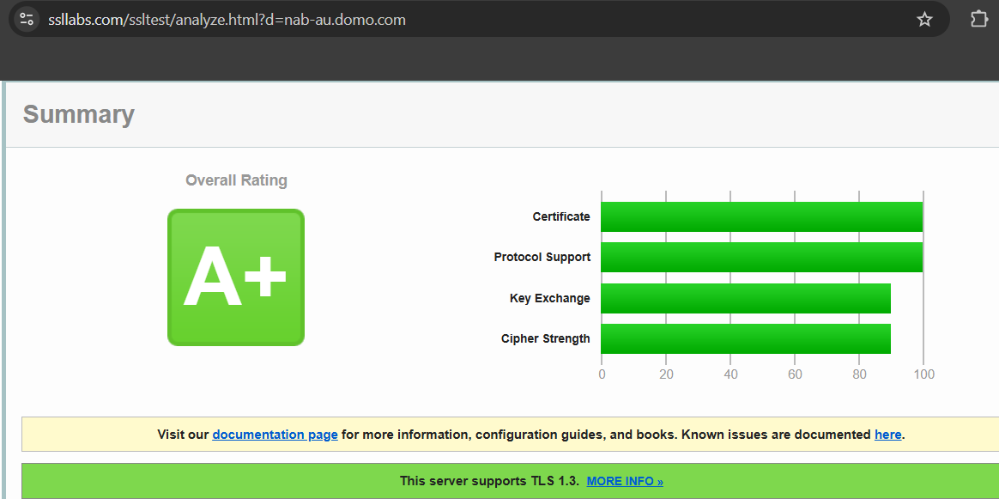

# KB Plan: Security Control Evidence Gaps (TPA Assessment)

Sep 30, 2026 · Jared Peterson · Source doc: https://claude.ai/code/artifact/dc0471d1-c387-44eb-8b7a-f3a421db02c5

> **Internal working file.** Contains customer names, a customer hostname, internal email text, and internal-only InfoSec context. This file and `TPA-Security-KB-Plan-ssllabs-example.png` are committed on `jared.peterson/tpa-security-articles` (commit `881edecf`) for the executing agent. Never reference them from `docs.json`, never publish any part of them verbatim, and never let them merge into `main`.

## Summary

The KB has no page that states Domo's security control posture for encryption in transit, vulnerability remediation, or log retention, so the RFP team had to assemble answers for NAB's Third Party Assessment by email. This plan adds one canonical security reference article so the next assessor, CSM, or proposal manager can cite a public page instead of chasing Information Security.

The fix is one new reference article, **Review Domo Security and Compliance Controls** (`s/article/Review-Domo-Security-and-Compliance-Controls.mdx`), plus small corrections to seven existing articles. The article covers certifications and how to request SOC reports; encryption in transit (TLS), including how customers verify TLS on their own instance; vulnerability management at summary level; and security log retention. All five InfoSec questions are now answered (Paul Conover, 29 September 2026). The biggest change: remediation timelines stay internal, so the public article states no day counts or CVSS thresholds.

**This plan is instructions for a Claude agent working in the domo-documentation-hub repo.** Start at [How to execute this plan](#how-to-execute-this-plan). The full email threads (both), the SSL Labs example screenshot, and the exact current repo text are in [Reference: email and repo](#reference-email-and-repo) at the end of this file. Treat that section and the [InfoSec decisions](#infosec-decisions-paul-conover-29-september-2026) table as the only approved source of security claims.

## How to execute this plan

Run the repo's own skills in this order. Each skill's `SKILL.md` lives in `.claude/skills/<name>/`; read it before invoking. Work on branch `jared.peterson/tpa-security-articles` (already checked out and pushed; this plan file is committed at the repo root).

1. **Read context first:** `CLAUDE.md`, `Domo-KB-Style-Guide.mdx`, `New-Article-Template.mdx`, this whole plan, and the Reference section. Confirm `git branch --show-current` returns `jared.peterson/tpa-security-articles`.
2. **`new-kb-article`** — invoke with the argument `Review Domo Security and Compliance Controls — source: TPA-Security-KB-Plan.md (repo root)`. Its Step 1 runs **`kb-intake`** automatically; if it does not, invoke `kb-intake` yourself with the same argument first.
    - During intake, answer each Socratic question from [Intake answers](#intake-answers-for-kb-intake) instead of asking Jared. Ask Jared only about something this plan does not cover, one question at a time.
    - Present the Article Intake Summary built from those answers and get Jared's confirmation, as the skill requires.
    - Step 3 release info: GA, not tied to any product release, no branch cut date, no feature switch date. Branch stays `jared.peterson/tpa-security-articles`, base `main`.
    - Step 4 screenshots: see [Screenshot](#screenshot). Icons: only the external-link icon (`icon-arrow-square-out`) on off-site links.
    - Steps 6–8: draft from the [Article spec](#article-spec-review-domo-security-and-compliance-controls), preserving the approved wording, then run the skill's fact-check and style edit passes. Every claim must trace to the Reference section or the InfoSec decisions table.
    - Step 8.5: show Jared the full copy and get approval before navigation.
    - Step 9 (`add-to-nav`): follow [Navigation](#navigation).
    - Step 11 localization offer: the answer is no for es/fr/de unless Jared says otherwise. Japanese runs on a separate pipeline.
3. **`update-kb-article`** — invoke as a *Cross-file change* for edits B1, B2, B4–B7. Present the plan to Jared and apply after approval. Do not touch `ja/`, `de/`, `es/`, or `fr/` (the skill forbids it); list B3 in the PR description instead.
4. **`update-pm-ownership`** — regenerate `Article-PM-Ownership-Reference.mdx` and `.github/CODEOWNERS` so the new article is listed under Feature "Application Security".
5. **Commit** the article, its screenshot, the edited articles, `docs.json`, and the regenerated ownership files. Do not edit or delete `TPA-Security-KB-Plan.md` or `TPA-Security-KB-Plan-ssllabs-example.png` while executing; they stay on the branch until Jared decides (see PR notes). Commit messages present tense, e.g. `Add Review Domo Security and Compliance Controls article`.
6. **`generate-mint-preview-link`** — follow [Preview link](#preview-link), then report the URL to Jared.
7. Stop there. Do not open the PR unless Jared asks; when he does, use [PR notes](#pr-notes-only-when-jared-asks-for-the-pr).

## The request

On 11 September 2026 NAB's Third Party Assessment team asked for more evidence on three controls. Doug Zagami (Senior Proposal Manager) drafted answers, Paul Conover (VP, Information Security & Compliance) resolved the TLS question on 15 September, and on 25 September Doug flagged to Paul and Jared that none of it is in the KB.

| Control | NAB's ask (verbatim) | Domo's approved answer | Evidence source |
| --- | --- | --- | --- |
| TLS 1.3 implementation | "Evidence confirming TLS 1.3 is implemented for data in transit. Examples may include security standards, network/security architecture documentation, configuration screenshots, or other relevant artefacts." | Minimum supported TLS for external customer communications is 1.2. TLS 1.3 is supported where the client and connection path support it. Version is negotiated automatically; customers do not configure or select it per instance. | SSL Labs scan of the customer's instance (e.g. nab-au.domo.com: A+ rating, "This server supports TLS 1.3") |
| Patch management timelines | "Patch Management Policy, Vulnerability Management Standard, or equivalent documentation showing defined remediation timelines for vulnerabilities (e.g., Critical, High, Medium, Low)." | Critical/High with known exploitation: 7 days (highest-exposure assets), 14 days (lower exposure). High without active exploitation: 14 days from patch availability. Medium/Low: routine cadence by asset class. CVSS 7.0+ triggers out-of-band remediation. | 2025 SOC 2 Type II, Control CC7.1 (bi-weekly internal and external scanning; no deviations) |
| Log retention | "Logging and Monitoring Policy or equivalent documentation confirming security logs are retained for a minimum of 12 months." | System logs are retained for one year and record user activity, system events, date/time, and affected objects. | 2025 SOC 2 Type II CC7.2 and PI1.5; 2025 SOC 1 Type II CO6.4 (no deviations) |

Two earlier InfoSec answers read as contradictory: "The floor TLS for Domo is 1.2. It is not configurable to be explicitly 1.3" (8 May 2026) and "Domo does support TLS 1.3 concurrently" (13 August 2026). Paul's 15 September statement reconciles them, and that reconciliation is what the KB is missing. Domo does not distribute internal security policies, so the KB must publish summaries, not the policies themselves. The patch timelines in the table above were shared privately with NAB and are internal only (Q1).

## InfoSec decisions (Paul Conover, 29 September 2026)

Jared sent Q1–Q4 to Paul on 29 September; Paul replied the same day (verbatim in Reference §1d–1e). Jared answered Q5. These answers override anything else in this plan.

| # | Question | Answer | What it means for the article |
| --- | --- | --- | --- |
| Q1 | Can remediation timelines and SOC control references be public, or summary-level only? | "No. Timelines should remain internal and not indicate any public commitment at this point in time. Also, they are likely to change with the Progress acquisition…" | Vulnerability section is summary-level. No day counts (7/14 days), no CVSS 7.0 threshold, no scanning cadence (bi-weekly). Never mention the Progress acquisition. Default: cite "Domo's SOC 1 and SOC 2 Type II reports" without control IDs (CC7.1, CC7.2, PI1.5, CO6.4); flag control IDs for Paul in review. |
| Q2 | Does "external customer communications" cover connectors, Workbench, Federated, SFTP, and APIs? | "only to the point Domo has control of the configuration. Wherever a customer chooses an insecure configuration, it of course would not apply. For example if they configure a connector with intentionally insecure configuration or use insecure protocols in an app, call insecure protocols from CodeEngine, Jupyter, etc." | Add a scope statement: the TLS minimum applies where Domo controls the configuration, not where a customer chooses an insecure one (connectors, apps, Code Engine, Jupyter). |
| Q3 | Official path to request SOC 1/SOC 2 reports? | "typically it will be the accounts team submitting a salesforce ticket for the RFP team and signing an NDA. Ideally we would move this into the Progress trust portal at some point." | Public wording: contact your Domo account team; an NDA is required. Do not describe the internal Salesforce ticket or mention a trust portal. |
| Q4 | Pen testing annual or bi-annual? | "we should publicly state 'at least annually.' Internally and in contracts we can loosen where necessary. We strive for quarterly, but… [not] to openly commit to" | Say "at least annually" everywhere public. Never say quarterly. Fix `360043428233.mdx` ("bi-annually"). |
| Q5 | Which Domo-owned instance to scan for the screenshot? | Jared: scan `domo.domo.com`. | Pre-checked 29 Sep 2026 with `openssl s_client`: `domo.domo.com:443` negotiated TLSv1.3 (TLS_AES_256_GCM_SHA384) and TLSv1.2. Capture the SSL Labs screenshot from this host. |

Still for Paul to confirm in PR review (not blocking the draft): whether SOC control IDs may appear publicly, and the one-year system log retention sentence.

## Current KB coverage

The KB touches all three controls only in passing, and its one explicit TLS statement is now incomplete. Repo: `~/Documents/GitHub/domo-documentation-hub` (Mintlify; checked at `main` @ `535b1602`). Live pages were confirmed through the Domo documentation index on domo.com/docs.

| Article (repo path) | What it says today | Problem |
| --- | --- | --- |
| [Mobile Enterprise Security](https://domo.com/docs/s/article/1500007028582) · `s/article/1500007028582.mdx` line 49 | "…Domo uses a combination of secure protocols, including TLS… We use TLS 1.2." | States 1.2 as if it were the only version; no mention of 1.3 or negotiation. This is the sentence an assessor finds. |
| [Domo Mobile Security](https://domo.com/docs/s/article/360043428233) · `s/article/360043428233.mdx` line 26 | Same paragraph, ending "We use TLS 1.2." Also says pen tests run "bi-annually". | Same TLS gap. Pen test frequency conflicts with domo.com/platform/security ("annual penetration tests"). |
| `ja/s/article/1500007028582.mdx` line 43 · `ja/s/article/360043428233.mdx` line 26 | Japanese translations of the same paragraph | Must be re-localized after the English fix. No de/es/fr copies exist. |
| [Domo FAQs](https://domo.com/docs/s/article/360043427493) · `s/article/360043427493.mdx` line 24 | "Is there an ISO 27001 certification?" answer | Only compliance mention in the KB; no SOC 1/SOC 2, no report-request path. Also has a ja copy. |
| [Activity Log](https://domo.com/docs/s/article/360042934574) · `s/article/360042934574.mdx` lines 35, 46 | Activity log holds "the rolling one-year period" | Customer-facing log only; says nothing about Domo's internal security/system log retention. |
| Shipping Logs to SIEM · `portal/Security/Integration with SIEM.mdx` | Webhook export of Activity logs to Sentinel | Useful for "keep logs longer yourself"; not linked from any KB security page. |
| [Domo APIs](https://domo.com/docs/s/article/360043439793) `s/article/360043439793.mdx` · [Federated Data](https://domo.com/docs/s/article/360042932974) `s/article/360042932974.mdx` §Data in Transit · [Workbench Encryption](https://domo.com/docs/s/article/000005248) `s/article/000005248.mdx` line 28 | "Encrypted in transit" / "vulnerability assessments" in general terms | No version, timeline, or link to a canonical page. |

Nothing in `s/article/`, `s/topic/`, or `portal/` mentions TLS 1.3, SOC 2, remediation timelines, or CVSS. The nav group **Knowledge Base › Admin › Administrate Domo › Security** (`docs.json` line 2417) holds ten configuration how-tos (MFA, IP allowlist, BYOK, sessions, passwords, tokens) and no reference content. The public [security page](https://www.domo.com/platform/security) lists SOC 1, SOC 2, ISO 27001, ISO 27018, HIPAA, HITRUST, GDPR, and CCPA, but gives no TLS version, retention period, or report-request process.

## Gap analysis

Two of three controls are missing outright, and the third is covered by a sentence that undersells Domo's posture.

| Control | KB status | Specific gap | Fix (see Proposed changes) |
| --- | --- | --- | --- |
| TLS / encryption in transit | Partial, misleading | "We use TLS 1.2" in two mobile articles; no TLS 1.3, no negotiation, no "not configurable per instance" statement; no way for a customer to evidence it | Article §Encryption in Transit (TLS) and its Verify subsection; update B1, B2, B3 |
| Vulnerability and patch management | Missing | No remediation timelines, CVSS threshold, scanning cadence, or SOC 2 CC7.1 reference; pen test frequency inconsistent (bi-annual vs annual) | Article §Vulnerability and Patch Management; fix B2 pen test line |
| Security log retention | Missing (customer log only) | Activity Log's one-year window is documented, but not Domo's system log retention or its SOC control references | Article §Security Logging and Log Retention; update B5, B6 |
| Compliance evidence and reports | Minimal | Only the ISO 27001 FAQ; no SOC 1/SOC 2 page, no report-request path, no "we don't share internal policies" statement | Article §Certifications and Audit Reports; update B4 |
| Discoverability | Missing | Security nav group is config-only; no page an assessor can land on | Place the article in the existing Security nav group (see Navigation) |

## Proposed changes

One new article (A) and seven edits to existing ones (B1–B7). All copy below is draft, built only from the Reference section and the InfoSec decisions table; add no claims beyond them.

### Intake answers (for `kb-intake`)

Use these to answer `kb-intake`'s questions and to fill its Article Intake Summary.

| Intake field | Answer |
| --- | --- |
| Working title | Review Domo Security and Compliance Controls |
| Target persona | Customer security and procurement reviewers, third-party assessors (e.g. a bank's TPA team), and Domo's RFP, proposal, and CS teams answering security questionnaires. Technical, but not Domo admins. |
| Goal | Find Domo's approved statements on certifications, SOC reports, TLS, vulnerability management, and log retention, and produce TLS evidence for their own instance. |
| Most important takeaway | Domo requires TLS 1.2 at minimum, supports TLS 1.3 automatically, retains system logs for one year, and verifies these controls in SOC 1 and SOC 2 Type II reports available under NDA. |
| Prerequisites / Required grants | None; this is a reference article with no in-product task, so omit the Required Grants section. The only grant mentioned is for viewing the Activity Log: Admin role or a custom role with **View Activity Logs** (per `portal/Security/Integration with SIEM.mdx`; confirm canonical wording with `grep -rn "View Activity Logs" s/article/`). |
| Screenshot and icon handling | One new screenshot: SSL Labs Summary for `domo.domo.com` (see Screenshot). Icon: `icon-arrow-square-out` on external links only. |
| Tasks (in order) | 1. Review certifications and request SOC reports. 2. Review encryption in transit. 3. Verify TLS on your instance. 4. Review vulnerability management. 5. Review security log retention. |
| Edge cases / gotchas | TLS version cannot be forced per instance; TLS minimum does not apply to customer-chosen insecure configurations; Activity Log (one-year rolling) is different from Domo's system logs; Domo does not share internal policy documents. |
| FAQ candidates | See FAQ in the outline. |
| Related articles | Activity Log (`360042934574`), DomoStats Connector (`360043433813`), Encrypting Data with BYOK (`360043427593`), Enable Multi-factor Authentication (`360043439193`), Allowlist IP Addresses (`360043439173`), Session Settings (`000005431`), Domo Mobile Security (`360043428233`). |
| PM owner | Feature "Application Security" (no PM listed in `Article-PM-Ownership-Reference.mdx`). Content approver: Paul Conover, VP Information Security & Compliance. |
| Out of scope | Remediation day counts, CVSS thresholds, scanning cadence, internal policy documents, the Progress acquisition, trust portals, the internal Salesforce/RFP request process, customer names. |
| Open questions | SOC control IDs public or not; one-year system log sentence. Both go to Paul in PR review. |

### Article spec: Review Domo Security and Compliance Controls

| Field | Value |
| --- | --- |
| File | `s/article/Review-Domo-Security-and-Compliance-Controls.mdx` (filename matches title per `new-kb-article` Step 6) |
| title | Review Domo Security and Compliance Controls |
| excerpt | "Review how Domo encrypts data in transit, manages vulnerabilities, and retains security logs, and how to request Domo's SOC reports." |
| Release status | GA; no beta tag or badge |

Headings follow the style guide's imperative rule. Anchors below are what B1–B7 link to; if the edit pass renames a heading, update every B link to the new slug and confirm it in the preview.

| Heading | Expected anchor |
| --- | --- |
| Review Certifications and Audit Reports (H2) | `#review-certifications-and-audit-reports` |
| Review Encryption in Transit (H2) | `#review-encryption-in-transit` |
| Verify TLS Support for Your Instance (H3 under the one above) | `#verify-tls-support-for-your-instance` |
| Review Vulnerability Management (H2) | `#review-vulnerability-management` |
| Review Security Log Retention (H2) | `#review-security-log-retention` |

#### Outline and approved copy

- **## Intro** — "This article covers Domo's security certifications and SOC reports, how Domo encrypts data in transit and how to verify TLS on your instance, and how Domo manages vulnerabilities and retains security logs." Follow with `---`. No table of contents.
- **## Review Certifications and Audit Reports**
    - Domo holds SOC 1, SOC 2, ISO/IEC 27001, ISO/IEC 27018, HIPAA, HITRUST, GDPR, and CCPA (source: domo.com/platform/security). Link the existing ISO press release used in `360043427493.mdx`.
    - "To request Domo's SOC 1 or SOC 2 Type II report, contact your Domo account team. A signed NDA is required before reports are shared." (Q3)
    - "Domo does not distribute copies of its internal security policies. The controls are summarized in this article and verified in Domo's SOC reports."
- **## Review Encryption in Transit**
    - Paul's statement, lightly edited, meaning unchanged: "Domo's minimum supported TLS version for external customer communications is TLS 1.2. Domo also supports TLS 1.3 where the client and connection path support it. The TLS version is negotiated automatically when a session is established, so you do not configure or select a TLS version for your Domo instance."
    - Scope (Q2): "This applies wherever Domo controls the configuration. It does not apply to connections you configure to be insecure, such as a connector set up with an insecure configuration, or insecure protocols used in an app, Code Engine, or Jupyter." Verify product-name spelling (Code Engine, Jupyter Workspaces) against the style guide's Domo-Specific Terms table.
    - Reuse approved wording from `1500007028582.mdx` line 49: TLS with a limited set of trusted ciphers; SSH and SFTP where appropriate; no clear-text or unencrypted protocols.
    - **### Verify TLS Support for Your Instance** (numbered steps):
        1. Go to [SSL Labs Server Test](https://www.ssllabs.com/ssltest/).
        2. Enter your instance hostname, for example `yourcompany.domo.com`.
        3. (Optional) Select **Do not show the results on the boards**.
        4. Select **Submit**. The scan takes a few minutes.
        5. In **Summary**, confirm the banner "This server supports TLS 1.3." Capture a screenshot that includes the address bar, so the hostname is visible.
    - `<Note>`: "A third-party scan tests the connection path it reaches, typically your instance's browser endpoint."
    - Screenshot (`<Frame>`) goes after step 5.
- **## Review Vulnerability Management** (summary-level, Q1)
    - "Domo maintains approved patch and vulnerability management standards that prioritize remediation by severity and exposure, scored using CVSS."
    - "Domo performs internal and external vulnerability scanning, and its vulnerability management process is tested in Domo's SOC 2 Type II examination." No cadence.
    - "Domo undergoes independent third-party penetration testing at least annually." (Q4)
    - Report a vulnerability: link Domo's responsible disclosure program from domo.com/platform/security.
    - Forbidden here: day counts, the CVSS 7.0 threshold, "bi-weekly", "quarterly", "Progress".
- **## Review Security Log Retention**
    - "Domo retains system logs for one year. These logs track user activity and system events and record the date and time of each event and the objects affected. This control is tested in Domo's SOC 1 and SOC 2 Type II examinations."
    - Activity Log: admins see a rolling one-year window in **Admin Settings › Governance › Activity log**; link `/s/article/360042934574`. Grant per the intake row.
    - To keep history longer: DomoStats Activity Log report (`/s/article/360043433813`) or send logs to a SIEM (`portal/Security/Integration with SIEM.mdx`, permalink `shipping-logs-to-siem`).
- **## FAQ** (`<AccordionGroup>`):
    - "Can I require TLS 1.3 only for my instance?" → "No. The TLS version is negotiated automatically and cannot be set for an individual instance."
    - "Does the TLS 1.2 minimum apply to my connectors and custom code?" → Q2 wording.
    - "How do I get Domo's SOC reports?" → Q3 wording.
    - "Can I get a copy of Domo's security policies?" → "No. Domo summarizes its controls here and in its SOC reports."
    - "How often does Domo run penetration tests?" → "At least annually."
- **## Related Articles** — list from the intake row.

#### Screenshot

- Capture SSL Labs for `domo.domo.com` (Q5): `https://www.ssllabs.com/ssltest/analyze.html?d=domo.domo.com&hideResults=on`. Crop to the Summary panel plus address bar, matching the layout of the NAB example in the Reference section (never use the NAB image).
- Save as `images/kb/Review-Domo-Security-and-Compliance-Controls-ssllabs.png` on the branch before the article references it. Alt text: "SSL Labs summary for domo.domo.com showing TLS 1.3 support".
- If you have no browser tool, pause and ask Jared to capture it to that path; do not use a placeholder unless he chooses one.

### Edits to existing articles

| ID | File | Change |
| --- | --- | --- |
| B1 | `s/article/1500007028582.mdx` line 49 | Replace "We use TLS 1.2." with "Domo requires TLS 1.2 at minimum and supports TLS 1.3, negotiated automatically for each connection. See [Review Encryption in Transit](/s/article/Review-Domo-Security-and-Compliance-Controls#review-encryption-in-transit)." |
| B2 | `s/article/360043428233.mdx` line 26 and §Third-party penetration testing | Same TLS replacement as B1. Change "penetration tests bi-annually" to "penetration tests at least annually" (Q4). Leave the ISR sentence as is. |
| B3 | `ja/s/article/1500007028582.mdx`, `ja/s/article/360043428233.mdx`, `ja/s/article/360043427493.mdx` | Do not edit. List in the PR description for the Japanese localization pipeline. |
| B4 | `s/article/360043427493.mdx` after the ISO answer (lines 24–26) | Add FAQ "Does Domo have SOC 1 and SOC 2 reports?" → "Yes. See [Review Certifications and Audit Reports](/s/article/Review-Domo-Security-and-Compliance-Controls#review-certifications-and-audit-reports)." |
| B5 | `s/article/360042934574.mdx` near line 35 | Add `<Note>`: "This log shows activity in your instance. For Domo's platform log retention, see [Review Security Log Retention](/s/article/Review-Domo-Security-and-Compliance-Controls#review-security-log-retention)." |
| B6 | `portal/Security/Integration with SIEM.mdx` | Add one sentence linking `#review-security-log-retention`. No other edits. |
| B7 | `s/article/360043439793.mdx` line 6 · `s/article/360042932974.mdx` §Data in Transit (both Standard and Agent sections) · `s/article/000005248.mdx` line 28 | Link "encrypted in transit" / "All traffic… is encrypted" to `#review-encryption-in-transit`, and "vulnerability assessments" to `#review-vulnerability-management`. Text otherwise unchanged. |

## Implementation

Standard, non-GA content work on `jared.peterson/tpa-security-articles`, base `main`. Publishing follows the weekly KB cadence in `CLAUDE.md`: PRs in by Thursday go live the following Monday, and merged is not live.

### Navigation

When `new-kb-article` reaches Step 9 and calls `add-to-nav`:

1. **Read the existing security articles first.** Run `grep -n '"group": "Security"' docs.json` (the KB match is line 2417: Knowledge Base › Admin › Administrate Domo › Security), read that group's `pages`, then open the frontmatter and Intro of each: `360042934454`, `360043439173`, `360042934514`, `000005831`, `360043439193`, `360043427593`, `360042934494`, `000005431`, `360042934474`, `360042934534`. Also check line 3643 (the Developer Portal Security group) so you pick the KB group, not the portal one.
2. **Place it in the existing group.** Default: insert `"s/article/Review-Domo-Security-and-Compliance-Controls"` into that Security group, at the beginning if it reads as the section's overview, otherwise where it fits beside related pages. Justify the position to Jared.
3. **Only create a new group if absolutely necessary**, meaning no existing group fits and Jared agrees. A single article does not justify a sub-group.
4. Follow `add-to-nav`: plan the edit, confirm with Jared, make a surgical `Edit`, then validate with `python3 -c "import json; json.load(open('docs.json')); print('valid')"`.

### Preview link

Run after the article, B-edits, nav, and ownership files are committed.

1. Read `.claude/skills/generate-mint-preview-link/SKILL.md`.
2. Credentials: `.env` at the repo root already defines `MINTLIFY_KEY` (admin key, `mint_` prefix) and `MINTLIFY_PROJECT_ID`, which `scripts/mint-preview.sh` reads. Never print, echo, or commit either value.
3. The branch must be on `origin`. The branch already exists on `origin`. After committing, ask Jared once to confirm, then `git push origin jared.peterson/tpa-security-articles`. Before running the preview, tell Jared the preview deploy builds from the whole branch, including the two plan files, and ask whether to remove them from the branch first (`git rm TPA-Security-KB-Plan.md TPA-Security-KB-Plan-ssllabs-example.png`, commit, push) or to exclude them from the build.
4. Run `./scripts/mint-preview.sh jared.peterson/tpa-security-articles` and relay the `previewUrl`. The build takes a minute or two.
5. In the preview, confirm the article renders, the screenshot loads, it sits in the chosen nav spot, and every B1–B7 anchor lands on its heading.
6. Errors: 400 = branch not on origin; 401/403 = key, project ID, or plan; 429 = rate limit of 5 requests/min, so wait and do not retry in a loop.

### PR notes (only when Jared asks for the PR)

- Title: "Add Review Domo Security and Compliance Controls article". Assign to Jared Peterson; request review from Paul Conover (content accuracy) and Doug Zagami (assessor usefulness).
- Description: the preview URL; the InfoSec decisions table; the two review items for Paul; the B3 Japanese files needing re-localization.
- Before opening the PR, the two plan files must be removed from the branch (`git rm` + commit) so they never reach `main`. Confirm with Jared first.

### Acceptance checks

- [ ] Every factual sentence traces to the Reference section or the InfoSec decisions table
- [ ] No day counts, CVSS thresholds, scanning cadence, "quarterly", "Progress", trust portal, or Salesforce process appear in any published file
- [ ] No customer names or hostnames (`nab-au.domo.com`, "NAB") appear in any published file or image
- [ ] `grep -rn "We use TLS 1.2" s` and `grep -rn "bi-annually" s/article/360043428233.mdx` return nothing
- [ ] Penetration testing reads "at least annually" in the new article and in `360043428233.mdx`
- [ ] The article has `title` + `excerpt` (no `description`), Intro followed by `---`, imperative headings, padded tables (`python3 scripts/pad_md_tables.py <file>`)
- [ ] `docs.json` is valid JSON and the article is in an existing Security group
- [ ] The preview URL works and all anchors resolve
- [ ] The two plan files are not in the PR diff against `main` and are not rendered in the preview
- [ ] Jared approved the copy (new-kb-article Step 8.5); Paul approves in the PR before merge

## Remaining items for Paul (in PR review)

- [ ] May the public article cite SOC control IDs (CC7.1, CC7.2, PI1.5, CO6.4), or should it say only "SOC 1 and SOC 2 Type II reports"? Default: omit IDs.
- [ ] Confirm the public sentence "Domo retains system logs for one year."

---

## Reference: email and repo

Everything the plan relies on, copied verbatim so the agent needs no mailbox or InfoSec access. Treat this section and the InfoSec decisions table as the only approved source of security claims; anything not here needs InfoSec's written answer first.

### 1. Email thread (verbatim, oldest first)

Subject: **DOMO - Request for Additional Security Control Evidence - TPA Assessment** · Outlook message ID `AAMkADk3NzZmYzliLWIxNGEtNDhkMy05YTcyLWQ4NjEyMzUzMTU0ZgBGAAAAAAAEm1iHSPw4SqSR8-Nz_M7ZBwAfDFgDsFrCQIUnFyI-vu-cAAAAAAEMAAAfDFgDsFrCQIUnFyI-vu-cAAWvB25PAAA=` (Jared's mailbox; flagged).

#### 1a. Doug Zagami → Paul Conover · Tue 15 Sep 2026, 1:39 PM

From: Doug Zagami <doug.zagami@domo.com> · To: Paul Conover <paul.conover@domo.com> · Cc: Wayne Will <wayne.will@domo.com>; Stewart Faith <stewart.faith@domo.com>; RFP & Security Team <rfp@domo.com>

> Paul,
>
> NAB's Third Party Assessment team came back on 11 September asking for additional evidence on three controls where they felt the evidence provided did not validate the requirement.
>
> **NAB's request:**
>
> **"TLS 1.3 Implementation**
> Evidence confirming TLS 1.3 is implemented for data in transit. Examples may include security standards, network/security architecture documentation, configuration screenshots, or other relevant artefacts."
>
> I have two prior responses from you:
>
> **8 May 2026**
> "The floor TLS for Domo is 1.2. It is not configurable to be explicitly 1.3 for a given Domo instance."
>
> **13 August 2026**
> "Domo does support TLS 1.3 concurrently."
>
> **Q1**
> Can you provide a single consolidated statement that accurately explains Domo's TLS posture for NAB and reconciles the two statements above?
> I would rather use your wording directly than risk inferring the intent behind either statement.
>
> **Q2**
> NAB indicated they would accept any of the following evidence types:
>
> - Security standards
> - Network/security architecture documentation
> - Configuration screenshots
> - Other relevant artefacts
>
> Based on the TLS posture described in your consolidated statement above, what do you believe is the best evidence to provide to NAB, and where or from whom can I obtain it?
>
> ---
>
> **@Stewart Faith**
>
> The responses on the other two controls, patch management timelines and log retention, are finished and ready to go to NAB. Both are answered from the 2025 SOC 1 and SOC 2 Type II reports, which NAB already holds, with the control references and the auditor's testing quoted so their assessment team can validate them directly. TLS is the only one outstanding, pending Paul's answer above.
>
> **Additional Security Control Evidence**
> Domo responses: Patch Management Timelines and Log Retention
>
> **1. Patch Management Timelines**
>
> *Customer question, verbatim*
> "Patch Management Policy, Vulnerability Management Standard, or equivalent documentation showing defined remediation timelines for vulnerabilities (e.g., Critical, High, Medium, Low)."
>
> *Domo evidence response*
> Domo maintains approved patch and vulnerability management standards that prioritise remediation by severity and exposure, scored using CVSS. Domo does not distribute copies of its internal security policies; the applicable standards are summarised below.
>
> *Remediation timelines by severity*
>
> - Critical and High severity vulnerabilities associated with known exploitation are targeted for remediation or mitigation within 7 days for the highest exposure assets and within 14 days for lower exposure asset classifications.
> - High risk vulnerabilities without active exploitation are targeted for remediation or mitigation within 14 days of patch availability.
> - Medium and Low severity vulnerabilities are remediated through Domo's routine patch cadence, which is assigned by asset class and prioritised by asset exposure and risk tier.
> - A CVSS score of 7.0 or above triggers expedited, out of band remediation outside the assigned cadence.
>
> **Independent evidence.** The 2025 SOC 2 Type II report addresses Domo's vulnerability management process under **Control CC7.1**.
>
> | Evidence element | Evidence from the 2025 SOC 2 Type II report |
> | --- | --- |
> | Criterion | "To meet its objectives, the entity uses detection and monitoring procedures to identify (1) changes to configurations that result in the introduction of new vulnerabilities, and (2) susceptibilities to newly discovered vulnerabilities." |
> | Control activity | "Internal and external vulnerability scanning is performed on a bi-weekly basis to identify vulnerabilities and management takes action in accordance with the vulnerability management policy, as necessary, based on the results." |
> | Service auditor testing | "Inspected the vulnerability remediation policy and a sample of vulnerability scans and remediation to determine that internal and external vulnerability scanning was performed on a bi-weekly basis to identify vulnerabilities and management took action in accordance with the vulnerability management policy, as necessary, based on the results." |
> | Test result | "No deviations noted." |
>
> The report's System Description also confirms: "The IRP includes levels of response to identified vulnerabilities that define the expected timelines for remediation based on severity and impact to consumer, brand, and company. These response guidelines are carefully mapped to level of severity determined for the reported vulnerability."
>
> The report covers the period 1 January 2025 through 30 November 2025 and was provided to NAB on 18 August 2026.
>
> **2. Log Retention**
>
> *Customer question, verbatim*
> "Logging and Monitoring Policy or equivalent documentation confirming security logs are retained for a minimum of 12 months."
>
> *Domo evidence response*
> Domo's 2025 SOC 1 and SOC 2 Type II reports confirm that system logs are retained for one year. These logs track user activity and system events and record the date and time of each event and the objects affected. In each examination, the service auditor inspected the retention settings and a sample of logs and reported no deviations.
>
> **Independent evidence.** The one year retention control is addressed under **Control CC7.2** of the 2025 SOC 2 Type II report, where it is repeated under **Control PI1.5**, and under **Control CO6.4** of the 2025 SOC 1 Type II report. The control wording and the auditor's testing are identical in each.
>
> | Evidence element | Evidence from the 2025 SOC 1 and SOC 2 Type II reports |
> | --- | --- |
> | Control activity | "System logs are retained for one year. Logs track both user activity and system events and record the date and time of the event and what objects the event impacted." |
> | Service auditor testing | "Inspected the log retention settings and a sample of logs to determine that system logs were retained for one year and that logs tracked both user activity and system events and recorded the date and time of the event and what objects the event impacted." |
> | Test result | "No deviations noted." |
>
> The reports cover the period 1 January 2025 through 30 November 2025. The SOC 2 Type II report was provided to NAB on 18 August 2026.
>
> Thanks,
> Doug Zagami, Senior Proposal Manager

#### 1b. Paul Conover → Doug Zagami · Tue 15 Sep 2026, 6:36 PM

From: Paul Conover <paul.conover@domo.com> (VP, Information Security & Compliance) · To: Doug Zagami · Cc: Wayne Will; Stewart Faith; RFP & Security Team

> Doug,
>
> **Q1 – TLS 1.3 Implementation**
> The two prior statements are both accurate and address different aspects of Domo's TLS posture. Domo's minimum supported TLS version for external customer communications is TLS 1.2. Domo also supports TLS 1.3 where supported by the client and connection path. TLS protocol version selection is negotiated automatically during session establishment, and customers do not configure or select a specific TLS version for a given Domo instance. As a result, Domo supports TLS 1.3 concurrently while maintaining TLS 1.2 as the minimum supported protocol version.
>
> **Q2 – Recommended Evidence**
> Evidence can be a screenshot demonstrating TLS 1.3 support directly on NAB's domo instance(s), such as ssllabs ssl test ( https://www.ssllabs.com/ssltest/analyze.html?d=nab%2dau.domo.com&latest ). See attached screenshot for the example result evidence (note the tls 1.3 support indicated at the bottom).
>
> Thanks,
> Paul Conover

Attached screenshot (inline `image.png`), SSL Labs result for `nab-au.domo.com`: overall rating A+, Certificate and Protocol Support at 100, Key Exchange and Cipher Strength near 90, and the banner "This server supports TLS 1.3." **Customer-identifying: layout reference only, never publish.**

#### 1c. Doug Zagami → Paul Conover, Jared Peterson · Fri 25 Sep 2026, 1:09 PM PT

To: Paul Conover; Jared Peterson · Cc: Wayne Will

> Hi Paul,
>
> I can't find this info anywhere in the KB and it seems like that would be a good place to put it.
>
> @Jared Peterson

#### 1d. Jared Peterson → Paul Conover · Tue 29 Sep 2026, 5:13 PM

> Hi @Paul Conover!
> Working on this KB addition now.
> Would you be able to answer some questions to provide additional context? These pasted below.
>
> 1. Can the remediation timelines and SOC control references (sent to NAB privately) be published on the public KB, or should the documentation be summary-level?
> 2. Does "external customer communications" cover connector traffic, Workbench, Federated, SFTP, and API calls, or only browser and app traffic to `*.domo.com`?
> 3. What is the official path for a customer to request SOC 1/SOC 2 reports (account team, NDA, trust portal)?
> 4. Is third-party penetration testing annual (domo.com/platform/security) or bi-annual (https://www.domo.com/docs/s/article/360043428233)?
>
> Once we get these squared away, I'll be able to get you all documentation to look over and approve.
> Thank you!
> Best,

#### 1e. Paul Conover → Jared Peterson · Tue 29 Sep 2026 (sent from iPhone)

> Jared, see responses below.
>
> 1) No. Timelines should remain internal and not indicate any public commitment at this point in time. Also, they are likely to change with the Progress acquisition when the product gets its vulnerability management issues ironed out.
>
> 2) only to the point Domo has control of the configuration. Wherever a customer chooses an insecure configuration, it of course would not apply. For example if they configure a connector with intentionally insecure configuration or use insecure protocols in an app, call insecure protocols from CodeEngine, Jupyter, etc.
>
> 3) typically it will be the accounts team submitting a salesforce ticket for the RFP team and signing an NDA. Ideally we would move this into the Progress trust portal at some point.
>
> 4) we should publicly state “at least annually.” Internally and in contracts we can loosen where necessary. We strive for quarterly, but many factors can cause that to be too aggressive to openly commit to or to explicitly bind in contracts.
>
> Paul

**Q5** (not sent to Paul): Jared confirmed on 29 Sep 2026 that `domo.domo.com` is the instance to scan for the public screenshot.

**Internal only:** the Progress acquisition, the quarterly pen-test aim, the Salesforce ticket process, and the trust portal must never appear in published KB content.

### 2. People

| Name | Role | Part in this work |
| --- | --- | --- |
| Paul Conover | VP, Information Security & Compliance | Source of TLS statement; approves all security wording |
| Doug Zagami | Senior Proposal Manager | Requester; authored patch and log responses |
| Stewart Faith | Cc'd on thread | Receiving the finished NAB responses |
| Wayne Will | Cc'd on thread | — |
| Jared Peterson | KB Administrator | PR reviewer and publisher |
| RFP & Security Team (rfp@domo.com) | Distribution list | Notify when live |

### 3. Current repo text to change (verbatim)

Repo `~/Documents/GitHub/domo-documentation-hub`, `main` @ `535b1602` ("Merge pull request #562 … fix-ai-toolkits-nav-json").

**`s/article/1500007028582.mdx` (Mobile Enterprise Security), line 49**

> To protect our customers' data as it is transmitted across untrusted networks, Domo uses a combination of secure protocols, including TLS, with only a limited number of trusted ciphers supported. SSH and SFTP are also supported, where appropriate, for the secure transfer of data. Domo does not allow clear text or unencrypted data communication protocols. Domo best practice ensures that all Domo customers use at least one of the provided secured services (TLS, SSH, SFTP). We use TLS 1.2.

**`s/article/360043428233.mdx` (Domo Mobile Security), line 26**

> To protect our customers' data as it is transmitted across untrusted networks, Domo uses a combination of secure protocols, including TLS, with only a limited number of trusted ciphers supported. SSH, and SFTP is also supported, where appropriate, for the secure transfer of data. Domo does not allow clear text or unencrypted data communication protocols. Domo's best practice ensures that all Domo customers use at least one of the provided secured services (TLS, SSH, SFTP). We use TLS 1.2.

**Same file, §Third-party penetration testing**

> Domo undergoes independent third-party application, mobile, system, and network penetration tests bi-annually. The executive reports detailing the scope, any findings, and the status of each finding is then made available to customers in our Independent Security Reports (ISR).

**`s/article/360043427493.mdx` (Domo FAQs), lines 24–26**

> ### Is there an ISO 27001 certification?
>
> We have both the ISO/IEC 27001 and ISO/IEC 27018 certificates for information security management. See the press release for more information.

**`s/article/360042934574.mdx` (Activity Log), line 35**

> The Activity log is updated in near real-time and includes activities logged within the rolling one-year period. You can explore the log with filters on the date range and the person who took the action.

**Japanese copies:** `ja/s/article/1500007028582.mdx` line 43, `ja/s/article/360043428233.mdx` line 26, `ja/s/article/360043427493.mdx`. No de/es/fr copies of these three.

**Navigation:** `docs.json` line 2417, `"group": "Security"`, pages `360042934454`, `360043439173`, `360042934514`, `000005831`, `360043439193`, `360043427593`, `360042934494`, `000005431`, `360042934474`, `360042934534`. Feature in `Article-PM-Ownership-Reference.mdx`: "Application Security" (no PM listed). Mobile articles: Feature "Mobile - iOS", PM Chris Wright.

### 4. Public-site facts used

[Enterprise Security and Compliance](https://www.domo.com/platform/security) (opened 29 Sep 2026): certifications "SOC 1, SOC 2, ISO 27001, ISO 27018, HIPAA, HITRUST, GDPR, and CCPA"; "Transport layer encryption and encryption at rest"; "third-party audits, compliance assessments, and annual penetration tests"; a responsible disclosure program. No TLS version, retention period, or report-request process is stated there.
