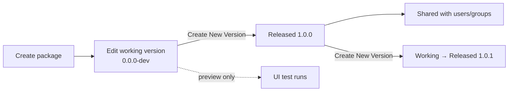

# Code Engine Documentation Rework Implementation Plan

> **For agentic workers:** REQUIRED SUB-SKILL: Use superpowers:subagent-driven-development (recommended) or superpowers:executing-plans to implement this plan task-by-task. Steps use checkbox (`- [ ]`) syntax for tracking.

**Goal:** Ship enterprise-grade Code Engine documentation accurate to current product code: comprehensive endpoint reference, self-contained calling guides for every integration mode (Custom App / Workflow / Brick / external REST), authoritative concept pages, and a refreshed hub.

**Architecture:** Follow the existing docs-hub pattern — markdown pages in `portal/` for concepts, tasks, and calling guides; OpenAPI specs in `openapi/` for endpoint contracts; `docs.json` wires them together. Consolidate the two colliding API-reference pages (`Product-APIs/Code-Engine.mdx` + `app-framework-apis/Code-Engine-API.mdx`) by retiring the app-framework page and redistributing its content into the new `calling/*` hub and the expanded OpenAPI specs.

**Tech Stack:** Mintlify, MDX, OpenAPI 3.0, `docs.json` navigation schema. Reference material in sibling repos: `DomoWeb/DomoWeb/public/javascripts/codeEngine/`, `domo.js/src/models/services/codeengine.ts`, `domoapps/odyssey-server/.../CodeEngineJobHandler.kt`.

---

## Planning decisions (flag to user before execution)

These decisions were made during plan-writing. They expand or reinterpret the approved spec — call out to user before starting execution if any need revisiting.

1. **OpenAPI for endpoint contracts, markdown for overview.** The spec said "rewrite `Product-APIs/Code-Engine.mdx` as a comprehensive endpoint reference." The existing docs-hub pattern (visible in `docs.json` lines 2777-2781 and other API specs in `openapi/product/` and `openapi/framework/`) uses OpenAPI YAML for per-endpoint reference pages and keeps markdown for overview/quickstart. Plan adopts that pattern: extend `openapi/product/codeengine.yaml` with the 7 new endpoints + schemas; the markdown page becomes an overview + quickstart that cross-links to each OpenAPI-rendered endpoint. Also extend `openapi/framework/codeengine.yaml` similarly for any endpoints that are reachable via framework auth.

2. **Two additional existing pages to refresh** — discovered during planning, not in spec:
   - `portal/Automate-Actions/Code-Engine/code-editor-overview.mdx`
   - `portal/Automate-Actions/Code-Engine/limitations-and-troubleshooting.mdx`
   Both are in the current nav. Plan includes light-refresh tasks for them (cross-links, consistency with new concept pages).

3. **`concepts/` and `calling/` directories are new.** Neither exists yet. Each new page task includes the directory creation implicitly via the file path in the Write tool.

4. **Redirects authored in `docs.json`.** The retired `app-framework-apis/Code-Engine-API.mdx` permalink (`fbhbpt1mt4gog-code-engine-api`) needs a redirect entry in the `redirects` section of `docs.json` so the existing permalink keeps working.

---

## File Structure

### New files

- `portal/Automate-Actions/Code-Engine/concepts/packages-and-versions.mdx`
- `portal/Automate-Actions/Code-Engine/concepts/functions-and-types.mdx`
- `portal/Automate-Actions/Code-Engine/concepts/permissions-and-sharing.mdx`
- `portal/Automate-Actions/Code-Engine/concepts/the-codeengine-library.mdx`
- `portal/Automate-Actions/Code-Engine/calling/from-a-custom-app.mdx`
- `portal/Automate-Actions/Code-Engine/calling/from-a-workflow.mdx`
- `portal/Automate-Actions/Code-Engine/calling/from-a-brick.mdx`
- `portal/Automate-Actions/Code-Engine/calling/from-outside-domo.mdx`
- `docs/superpowers/notes/2026-04-23-code-engine-sources.md` (working notes: source citations + UNVERIFIED log)

### Modified files

- `openapi/product/codeengine.yaml` — add 7 endpoints + schemas.
- `openapi/framework/codeengine.yaml` — extend with framework-reachable endpoints.
- `portal/API-Reference/Product-APIs/Code-Engine.mdx` — rewrite as overview + quickstart.
- `portal/Automate-Actions/Code-Engine/overview.mdx` — rewrite.
- `portal/Automate-Actions/Code-Engine/creating-packages.mdx` — split (UI content stays; library content moves out).
- `portal/Automate-Actions/Code-Engine/global-vs-custom-packages.mdx` — refresh cross-links.
- `portal/Automate-Actions/Code-Engine/common-use-cases.mdx` — refresh.
- `portal/Automate-Actions/Code-Engine/javascript-libraries.mdx` — rewrite.
- `portal/Automate-Actions/Code-Engine/python-packages.mdx` — verify + restructure.
- `portal/Automate-Actions/Code-Engine/code-editor-overview.mdx` — refresh cross-links.
- `portal/Automate-Actions/Code-Engine/limitations-and-troubleshooting.mdx` — refresh cross-links.
- `portal/Apps/App-Framework/Guides/hitting-code-engine-from-an-app.mdx` — stub + redirect.
- `docs.json` — new nav groups, new redirect entries.

### Deleted files

- `portal/API-Reference/app-framework-apis/Code-Engine-API.mdx` — content redistributed to calling guides + OpenAPI specs + Product-APIs markdown.

---

## Phase 0 — Source verification & notes

### Task 0.1: Create source-of-truth notes file

**Files:**
- Create: `docs/superpowers/notes/2026-04-23-code-engine-sources.md`

- [ ] **Step 1: Write the notes file**

Write the following file:

```markdown
# Code Engine Documentation — Source Citations & Verification Log

Working notes for the rework. Every technical claim in a new page must be traceable here. Any unverifiable claim is marked UNVERIFIED and logged at the bottom.

## Sibling repos (siblings to this repo)

- `~/Documents/GitHub/DomoWeb/DomoWeb/public/javascripts/codeEngine/` — Code Engine UI (TypeScript/React). Authoritative for endpoints, request/response shapes, enums.
- `~/Documents/GitHub/domo.js/` — ryuu.js SDK. Authoritative for `domo.codeEngine(alias, input)`.
- `~/Documents/GitHub/domoapps/` — Ryuu and Odyssey servers. Authoritative for server-side resolution and Workflow integration.

## Endpoint inventory (source: DomoWeb `api/function.api.ts` and `api/permissions.ts`)

| Endpoint | Method | Source file:line | Purpose |
|---|---|---|---|
| `/api/codeengine/v2/packages/{id}/versions/{version}/functions/{name}` | POST | `function.api.ts:142` | Run Function (preview from UI) |
| `/api/codeengine/v2/packages/{id}/executions/{executionId}` | GET | `function.api.ts:148` | Get Execution by ID |
| `/api/codeengine/v2/packages/{id}` | GET | `function.api.ts:30` | Get Package (`?parts=versions`) |
| `/api/codeengine/v2/packages/{id}/versions/{version}` | GET | `function.api.ts:166` | Get Version (`?parts=functions,code,privateFunctions`) |
| `/api/codeengine/v2/packages/{id}/versions/{version}/release` | POST | `function.api.ts:157` | Release Version |
| `/api/codeengine/v2/packages/{id}/share` | POST | `function.api.ts:175` | Share (incremental) |
| `/api/codeengine/v2/packages/{id}/permissions` | GET | `permissions.ts:8` | Get Permissions |
| `/api/codeengine/v2/packages/{id}/permissions` | POST | `permissions.ts:14` | Set Permissions |

**Excluded from public reference** (UI-owned — per spec decision):
- `POST /api/codeengine/v2/packages` (create), `PUT /api/codeengine/v2/packages/{id}` (properties), `DELETE /api/codeengine/v2/packages/{id}` (delete), `DELETE /api/codeengine/v2/packages/{id}/versions/{version}` (delete version).

## Custom App SDK (source: domo.js `src/models/services/codeengine.ts`)

- `domo.codeEngine<T>(alias, input?, options?)` → `POST /domo/codeengine/v2/packages/{alias}` → `Promise<T>`.
- Deprecated variant `/domo/codeengine/v2/packages/{alias}/complex` (2023-06-27) — not on SDK.

## Type system (source: DomoWeb `models/enums.ts` + `workflows/models/enums/DataTypes`)

`TypeEnumV2` / `WorkflowDataType` values available for function inputs/outputs:
- `text`, `number`, `decimal`, `boolean`, `date`, `dateTime`, `time`, `duration`, `object`, `person`, `dataset`, `group`
- `account` (gated on `FeatureFlag.ACCOUNT_ENTITY`)
- `file`, `directory` (gated on `FileSetFeatureAccess.isEnabled()`)
- Excluded from UI pickers: `JSON`, `STRING_BUILDER`

## Execution status (source: `models/enums.ts` ExecutionStatus)

`SUCCESS`, `FAILED`, `RESULT_TYPE_FAILURE`, `RUNNING`, `UNDEFINED`, `OUTPUT_UNDEFINED`.

## Permissions (source: `models/constants.ts` accessLevelToPermissionsMap)

UI label → API value:
- `OWNER` → `OWNER`
- `CAN_EDIT` → `WRITE`
- `CAN_SHARE` → `READ`
- `CAN_EXECUTE` → `EXECUTE`
- `NO_ACCESS` → `NONE`

## Runtime environments (source: `models/enums.ts` Environments)

`LAMBDA` (general-purpose, customer-visible), `ARRAKIS`, `DOMOACTION`, `MODELENDPOINT`, `PYTILE`, `UNDEFINED`.

## Runtimes (source: `models/enums.ts` RuntimesEnumV2)

`JavaScript`, `Python`.

## UNVERIFIED (source needed)

- **JS `codeengine` module method surface.** Current docs list `sendRequest`, `getAccount`, `axios`, `getPersonDetails`, `getExecutionDetails`. Runtime source not located in accessible sibling repos. **Action during plan execution:** search for the Code Engine Lambda/sandbox runtime (likely a separate internal service). If not found, ship pages with "as of 2026-04-23" note and log as followup.
- **JS `require()` allowlist.** Current `javascript-libraries.mdx` lists only 3 libraries. Runtime allowlist not located. **Action:** same as above.
- **Python runtime allowlist** — the list in `python-packages.mdx` has not been verified against runtime source.
- **Python-side `codeengine` equivalent module.** Existence unconfirmed.
- **Account alias configuration model.** `AccountAliasConfiguration` is defined in DomoWeb but the server-side contract (how it's stored, mapped, retrieved) hasn't been traced.
```

- [ ] **Step 2: Commit**

```bash
cd /Users/jason.hansen/Documents/GitHub/domo-documentation-hub
git add docs/superpowers/notes/2026-04-23-code-engine-sources.md
git commit -m "docs(notes): seed Code Engine rework source citations

Co-Authored-By: Claude Opus 4.7 (1M context) <noreply@anthropic.com>"
```

---

## Phase 1 — OpenAPI spec extension

### Task 1.1: Extend `openapi/product/codeengine.yaml` with the 7 new endpoints

**Files:**
- Modify: `openapi/product/codeengine.yaml` (currently contains only Run Function)

Context: the Run Function endpoint already exists in this file. Add the other 7 endpoints and a full schemas block. Keep the existing Run Function definition in place.

- [ ] **Step 1: Read the full current file**

```bash
cat /Users/jason.hansen/Documents/GitHub/domo-documentation-hub/openapi/product/codeengine.yaml
```

- [ ] **Step 2: Add schemas**

Under `components.schemas`, add (merging with any existing schemas — do not duplicate):

```yaml
    # ========= SHARED SCHEMAS =========
    Variable:
      type: object
      required: [name, type, isList]
      properties:
        name: { type: string }
        displayName: { type: string, nullable: true }
        type:
          type: string
          enum: [text, number, decimal, boolean, date, dateTime, time, duration, object, person, dataset, group, account, file, directory]
          description: The Code Engine type. See the Functions and Types concept page for semantics.
        isList: { type: boolean, default: false }
        nullable: { type: boolean, default: false }
        children:
          type: array
          items: { $ref: '#/components/schemas/Variable' }
          nullable: true
          description: For `object` type, the nested property definitions.
        defaultValues:
          nullable: true
          description: Optional default value.
        entitySubType: { type: string, nullable: true }
    Function:
      type: object
      required: [name]
      properties:
        name: { type: string }
        displayName: { type: string, nullable: true }
        description: { type: string, nullable: true }
        isPrivate: { type: boolean, default: false }
        inputs:
          type: array
          items: { $ref: '#/components/schemas/Variable' }
        output:
          allOf:
            - $ref: '#/components/schemas/Variable'
          nullable: true
        hasReturn: { type: boolean }
        example: { type: string, nullable: true }
    Version:
      type: object
      required: [version, packageId]
      properties:
        id: { type: string }
        packageId: { type: string }
        version:
          type: string
          description: Semantic version string. Must match [a-zA-Z0-9\-]+.
        description: { type: string, nullable: true }
        code: { type: string, description: Function source code (Python or JavaScript). }
        functions:
          type: array
          items: { $ref: '#/components/schemas/Function' }
        accountAliasConfiguration:
          type: array
          items:
            type: object
            properties:
              accountId: { type: string }
              alias: { type: string }
        releasedOn: { type: string, format: date-time, nullable: true }
        updatedOn: { type: string, format: date-time, nullable: true }
        createdBy: { type: string, nullable: true }
    FunctionPackage:
      type: object
      required: [id, name, language]
      properties:
        id: { type: string }
        name: { type: string }
        description: { type: string, nullable: true }
        language:
          type: string
          enum: [JavaScript, Python]
        environment:
          type: string
          enum: [LAMBDA]
          description: |
            The runtime environment. Customer-visible packages use `LAMBDA`.
            Additional internal environments (`ARRAKIS`, `DOMOACTION`, `MODELENDPOINT`, `PYTILE`) exist
            but are not user-selectable.
        thumbnail: { type: string, nullable: true }
        owner: { type: string, nullable: true }
        availability:
          type: string
          enum: [GLOBAL, PRIVATE]
        versions:
          type: array
          items: { $ref: '#/components/schemas/Version' }
        deployedVersion: { $ref: '#/components/schemas/Version' }
        workingVersion: { $ref: '#/components/schemas/Version' }
        createdOn: { type: string, format: date-time, nullable: true }
        updatedOn: { type: string, format: date-time, nullable: true }
        releasedOn: { type: string, format: date-time, nullable: true }
    ExecutionStatus:
      type: string
      enum: [SUCCESS, FAILED, RESULT_TYPE_FAILURE, RUNNING, OUTPUT_UNDEFINED, UNDEFINED]
      description: |
        - `SUCCESS`: function returned a value matching the declared output type.
        - `FAILED`: function threw or errored mid-execution.
        - `RESULT_TYPE_FAILURE`: function returned a value whose type does not match the declared output.
        - `RUNNING`: execution has not yet completed (valid for polled responses only).
        - `OUTPUT_UNDEFINED`: function did not return a value.
        - `UNDEFINED`: execution status could not be determined.
    FunctionExecution:
      type: object
      properties:
        executionId: { type: string }
        packageId: { type: string }
        version: { type: string }
        functionName: { type: string }
        status: { $ref: '#/components/schemas/ExecutionStatus' }
        settings:
          type: object
          properties:
            getLogs: { type: boolean }
        startedOn: { type: string, format: date-time }
        startedBy: { type: string }
        completedOn: { type: string, format: date-time, nullable: true }
        result:
          nullable: true
          description: The function's return value (type varies per function).
        stdout:
          $ref: '#/components/schemas/LogOutput'
        stderr:
          $ref: '#/components/schemas/LogOutput'
        errorInformation:
          $ref: '#/components/schemas/ErrorInformation'
    ShareRequest:
      type: object
      required: [permissions]
      properties:
        permissions:
          type: array
          items:
            type: string
            enum: [VIEW, EDIT, EXECUTE, OWNER]
          minItems: 1
        userIds:
          type: array
          items: { type: integer }
          description: Mutually exclusive with groupIds.
        groupIds:
          type: array
          items: { type: integer }
          description: Mutually exclusive with userIds.
    GroupedEntityPermissions:
      type: object
      description: Permissions grouped by entity type (users, groups).
      properties:
        users:
          type: array
          items:
            type: object
            properties:
              id: { type: integer }
              permissions:
                type: array
                items: { type: string, enum: [VIEW, EDIT, EXECUTE, OWNER] }
        groups:
          type: array
          items:
            type: object
            properties:
              id: { type: integer }
              permissions:
                type: array
                items: { type: string, enum: [VIEW, EDIT, EXECUTE, OWNER] }
```

Note: `LogOutput` and `ErrorInformation` already exist in the file; do not redefine. If `RunFunctionRequest` exists, keep it — the new Run Function path below references it.

- [ ] **Step 3: Add the 7 new endpoint paths**

Under `paths`, after the existing Run Function endpoint, add:

```yaml
  /api/codeengine/v2/packages/{packageId}/executions/{executionId}:
    get:
      tags: [Code Engine]
      summary: Get execution by ID
      description: |
        Re-fetch a prior execution by its ID. Useful after async Workflow steps where you
        captured the executionId but need to poll the final result.
      operationId: getCodeEngineExecution
      security:
        - developerToken: []
      parameters:
        - in: path
          name: packageId
          required: true
          schema: { type: string, format: uuid }
        - in: path
          name: executionId
          required: true
          schema: { type: string }
      responses:
        '200':
          description: Execution detail.
          content:
            application/json:
              schema: { $ref: '#/components/schemas/FunctionExecution' }
        '403': { description: Caller lacks EXECUTE permission on this package. }
        '404': { description: Execution not found (wrong packageId, wrong executionId, or execution expired). }

  /api/codeengine/v2/packages/{packageId}:
    get:
      tags: [Code Engine]
      summary: Get package
      description: |
        Retrieve a package's metadata. Pass `?parts=versions` to include the full version history.
      operationId: getCodeEnginePackage
      security:
        - developerToken: []
      parameters:
        - in: path
          name: packageId
          required: true
          schema: { type: string, format: uuid }
        - in: query
          name: parts
          required: false
          schema: { type: string, enum: [versions] }
          description: Include additional related data. Currently supports `versions`.
      responses:
        '200':
          description: Package metadata.
          content:
            application/json:
              schema: { $ref: '#/components/schemas/FunctionPackage' }
        '403': { description: Caller lacks VIEW permission on this package. }
        '404': { description: Package not found. }

  /api/codeengine/v2/packages/{packageId}/versions/{version}:
    get:
      tags: [Code Engine]
      summary: Get version
      description: |
        Retrieve a specific version of a package. Pass `?parts=functions,code,privateFunctions`
        to include the function list, source code, and private-function definitions.
      operationId: getCodeEngineVersion
      security:
        - developerToken: []
      parameters:
        - in: path
          name: packageId
          required: true
          schema: { type: string, format: uuid }
        - in: path
          name: version
          required: true
          schema: { type: string }
          description: Semantic version string (e.g. `1.0.1`). Must be a released version.
        - in: query
          name: parts
          required: false
          schema: { type: string }
          description: Comma-separated list. Accepts `functions`, `code`, `privateFunctions`.
      responses:
        '200':
          description: Version detail.
          content:
            application/json:
              schema: { $ref: '#/components/schemas/Version' }
        '403': { description: Caller lacks VIEW permission on this package. }
        '404': { description: Version not found (or not yet released). }

  /api/codeengine/v2/packages/{packageId}/versions/{version}/release:
    post:
      tags: [Code Engine]
      summary: Release a version
      description: |
        Promote a working version to a released version. Only released versions are callable
        by external consumers via Run Function.
      operationId: releaseCodeEngineVersion
      security:
        - developerToken: []
      parameters:
        - in: path
          name: packageId
          required: true
          schema: { type: string, format: uuid }
        - in: path
          name: version
          required: true
          schema: { type: string }
      responses:
        '200':
          description: Updated package with the newly released version.
          content:
            application/json:
              schema: { $ref: '#/components/schemas/FunctionPackage' }
        '403': { description: Caller lacks EDIT permission on this package. }
        '404': { description: Package or version not found. }
        '409': { description: Version is already released. }

  /api/codeengine/v2/packages/{packageId}/share:
    post:
      tags: [Code Engine]
      summary: Share package (incremental)
      description: |
        Grant one or more permissions to a user or group. To set the full permission set at once,
        use `POST /packages/{packageId}/permissions` instead.
      operationId: shareCodeEnginePackage
      security:
        - developerToken: []
      parameters:
        - in: path
          name: packageId
          required: true
          schema: { type: string, format: uuid }
      requestBody:
        required: true
        content:
          application/json:
            schema: { $ref: '#/components/schemas/ShareRequest' }
            examples:
              shareWithUser:
                summary: Grant EXECUTE to a user
                value:
                  permissions: [EXECUTE]
                  userIds: [481303514]
              shareWithGroup:
                summary: Grant VIEW + EXECUTE to a group
                value:
                  permissions: [VIEW, EXECUTE]
                  groupIds: [123]
      responses:
        '200': { description: Share applied. }
        '400': { description: Invalid body (e.g. both userIds and groupIds). }
        '403': { description: Caller lacks OWNER or EDIT permission on this package. }
        '404': { description: Package not found. }

  /api/codeengine/v2/packages/{packageId}/permissions:
    get:
      tags: [Code Engine]
      summary: Get permissions
      description: Read the full permission set for a package.
      operationId: getCodeEnginePermissions
      security:
        - developerToken: []
      parameters:
        - in: path
          name: packageId
          required: true
          schema: { type: string, format: uuid }
      responses:
        '200':
          description: Grouped permissions.
          content:
            application/json:
              schema: { $ref: '#/components/schemas/GroupedEntityPermissions' }
        '403': { description: Caller lacks VIEW permission. }
        '404': { description: Package not found. }
    post:
      tags: [Code Engine]
      summary: Set permissions
      description: |
        Replace the full permission set for a package. To add incrementally without replacing the
        existing set, use `POST /packages/{packageId}/share`.
      operationId: setCodeEnginePermissions
      security:
        - developerToken: []
      parameters:
        - in: path
          name: packageId
          required: true
          schema: { type: string, format: uuid }
      requestBody:
        required: true
        content:
          application/json:
            schema: { $ref: '#/components/schemas/GroupedEntityPermissions' }
      responses:
        '200':
          description: Updated permissions.
          content:
            application/json:
              schema: { $ref: '#/components/schemas/GroupedEntityPermissions' }
        '403': { description: Caller lacks OWNER permission. }
        '404': { description: Package not found. }
```

- [ ] **Step 3: Validate the YAML**

```bash
cd /Users/jason.hansen/Documents/GitHub/domo-documentation-hub
python3 -c "import yaml; yaml.safe_load(open('openapi/product/codeengine.yaml'))" && echo "YAML OK"
```

Expected: `YAML OK`.

- [ ] **Step 4: Commit**

```bash
git add openapi/product/codeengine.yaml
git commit -m "openapi(codeengine): expand product spec with 7 additional endpoints

Adds Get Execution, Get Package, Get Version, Release Version, Share,
Get/Set Permissions, plus full schemas (Variable, Function, Version,
FunctionPackage, FunctionExecution, ExecutionStatus, ShareRequest,
GroupedEntityPermissions).

Source: DomoWeb codeEngine/api/function.api.ts and permissions.ts.

Co-Authored-By: Claude Opus 4.7 (1M context) <noreply@anthropic.com>"
```

### Task 1.2: Extend `openapi/framework/codeengine.yaml` for SDK-reachable endpoints

**Files:**
- Modify: `openapi/framework/codeengine.yaml`

Context: this spec documents endpoints reachable via framework (bearer) auth — i.e. what ryuu.js calls. Currently has one endpoint (alias-based Run Function via `/domo/codeengine/v2/packages/{alias}`). Add a note about the deprecated `/complex` endpoint so readers encountering it in older code have a reference.

- [ ] **Step 1: Read current file**

```bash
cat /Users/jason.hansen/Documents/GitHub/domo-documentation-hub/openapi/framework/codeengine.yaml
```

- [ ] **Step 2: Add the `/complex` deprecated endpoint**

After the existing `/domo/codeengine/v2/packages/{alias}` path, add:

```yaml
  /domo/codeengine/v2/packages/{alias}/complex:
    post:
      tags: [Code Engine]
      deprecated: true
      summary: "Run by alias (complex response) — DEPRECATED 2023-06-27"
      description: |
        **Deprecated.** Wraps the aliased output in an execution envelope with `executionId`.
        The `ryuu.js` / `domo.js` SDK does not expose this endpoint. Use `POST /domo/codeengine/v2/packages/{alias}` instead.
      operationId: runCodeEngineByAliasComplex
      security:
        - bearerAuth: []
      parameters:
        - in: path
          name: alias
          required: true
          schema: { type: string }
      requestBody:
        required: true
        content:
          application/json:
            schema: { type: object, additionalProperties: true }
      responses:
        '200': { description: Execution envelope with aliased output. }
```

- [ ] **Step 3: Validate and commit**

```bash
cd /Users/jason.hansen/Documents/GitHub/domo-documentation-hub
python3 -c "import yaml; yaml.safe_load(open('openapi/framework/codeengine.yaml'))" && echo "YAML OK"
git add openapi/framework/codeengine.yaml
git commit -m "openapi(codeengine): document deprecated /complex alias variant

Co-Authored-By: Claude Opus 4.7 (1M context) <noreply@anthropic.com>"
```

---

## Phase 2 — New concept pages

Each concept-page task follows the same rhythm: create the file with the exact content structure, cite source for every technical claim, preview, commit. Exact content outlines below — the implementer writes explanatory prose that connects the specified sections, code samples, tables, and callouts.

### Task 2.1: Create `concepts/packages-and-versions.mdx`

**Files:**
- Create: `portal/Automate-Actions/Code-Engine/concepts/packages-and-versions.mdx`

- [ ] **Step 1: Write the file**

Frontmatter:

```yaml
---
title: Packages and Versions
description: How Code Engine organizes code — packages, working vs. released versions, semantic versioning, availability, and runtime environments.
---
```

Required sections and content:

1. **Intro** (2–3 paragraphs) — define the package → version → function hierarchy. A package is the container; a version is a point-in-time snapshot of the package's code + function definitions; functions are the callable units exported by a version.

2. **Working vs. released versions** — there is always exactly one working version (editable, typically tagged `0.0.0-dev`) per package, plus any number of released versions. **Only released versions are callable externally.** The UI's preview ("Start Function") runs against the working version and is not available via developer-token API. Include a Note callout reinforcing the "only released versions are externally callable" rule.

3. **Semantic versioning** — released version strings must match `[a-zA-Z0-9\-]+` (source: `models/constants.ts:71` `validRefNameRegex`). Recommended: semver — major.minor.patch.

4. **Creating a new version** — describe the "copy from prior version" flow that the UI uses (`saveVersion` in `function.api.ts:34`). The new version starts from a prior version's code + manifest; the user bumps the version string and optionally adds a description.

5. **Availability** — `GLOBAL` vs. `PRIVATE` (source: `models/interfaces.ts:167`). Global packages ship with Domo and are available in every instance. Private packages are custom to an instance.

6. **Runtimes** — JavaScript (Node-based) or Python (source: `models/enums.ts:27` `RuntimesEnumV2`). Link forward to `javascript-libraries.mdx` and `python-packages.mdx` for the available library surface.

7. **Runtime environments** — brief callout: customer-visible packages run on the `LAMBDA` environment. Additional internal environments (`ARRAKIS`, `DOMOACTION`, `MODELENDPOINT`, `PYTILE`) exist for internal-only package types (source: `models/enums.ts:32` `Environments`). Keep this section short; do not imply customer selection.

8. **Lifecycle diagram** — a Mermaid diagram showing the stages:

````mdx

````

9. **Cross-links** — "Next: see [Functions and Types](./functions-and-types) for how a version's functions declare inputs and outputs." "See [Permissions and Sharing](./permissions-and-sharing) to control who can view, edit, or execute a package." "To call a released version from your code, see [Calling Code Engine](../calling/from-a-custom-app)."

- [ ] **Step 2: Preview render**

```bash
# Start Mintlify preview if not running:
cd /Users/jason.hansen/Documents/GitHub/domo-documentation-hub
# Run: mintlify dev (per Mintlify toolchain — user runs manually if CLI not available)
```

Open the preview at `http://localhost:3000/portal/Automate-Actions/Code-Engine/concepts/packages-and-versions` and confirm Mermaid diagram renders, headers correct, links pointed at files that will exist by end of Phase 2/3.

- [ ] **Step 3: Commit**

```bash
git add portal/Automate-Actions/Code-Engine/concepts/packages-and-versions.mdx
git commit -m "docs(code-engine): add packages-and-versions concept page

Co-Authored-By: Claude Opus 4.7 (1M context) <noreply@anthropic.com>"
```

### Task 2.2: Create `concepts/functions-and-types.mdx`

**Files:**
- Create: `portal/Automate-Actions/Code-Engine/concepts/functions-and-types.mdx`

- [ ] **Step 1: Write the file**

Frontmatter:

```yaml
---
title: Functions and Types
description: How Code Engine functions declare inputs and outputs — the type system, lists, nullability, nested objects, account aliasing, and type-failure debugging.
---
```

Required sections:

1. **Intro** — a Code Engine function is an exported function in a package version. Its inputs and outputs are declared in the UI (stored as the package manifest) with explicit types. Typing is required for the function to be saveable, callable from Workflows, or wirable from Custom Apps.

2. **Type system** — the available input/output types, sourced from `TypeEnumV2` / `WorkflowDataType`:

Table:

| Type | Description | Example input |
|---|---|---|
| `text` | UTF-8 string. | `"hello"` |
| `number` | Integer. | `42` |
| `decimal` | Decimal/float. | `3.14` |
| `boolean` | True/false. | `true` |
| `date` | ISO date (no time). | `"2026-04-23"` |
| `dateTime` | ISO date + time. | `"2026-04-23T12:00:00Z"` |
| `time` | Time of day. | `"14:30:00"` |
| `duration` | ISO 8601 duration. | `"PT1H30M"` |
| `object` | Structured object. Define `children` to constrain shape, or leave open. | `{ "foo": 1 }` |
| `person` | A Domo user. Pass the user's ID as a string. Resolve details via `codeengine.getPersonDetails`. | `"481303514"` |
| `dataset` | A Domo dataset. Pass the dataset ID as a string. | `"abc-123-def"` |
| `group` | A Domo group. Pass the group's ID as a string. | `"42"` |
| `account` | A Domo Account. Feature-gated on `ACCOUNT_ENTITY`. | See Account aliasing below. |
| `file`, `directory` | FileSet entities. Feature-gated on FileSet. | See FileSet docs. |

3. **List and nullability** — any type can be declared as `isList: true` (an array of that type) or `nullable: true` (allow `null`). A list of nullable objects is allowed.

4. **Nested objects** — when `type: object`, populate `children` with an array of `Variable` definitions to constrain the shape. Leaving `children` empty/null allows any object.

5. **Account aliasing** — when a function needs a stored Domo Account (e.g. to call a third-party API), the package defines `accountAliasConfiguration` entries mapping accountId → alias. Inside the function, call `codeengine.getAccount(alias)` to retrieve the credentials. Cross-link to `concepts/the-codeengine-library`.

6. **Writing a function** — side-by-side JS and Python examples, each with: one primitive input, one `person` input, one list-of-number input, one `object` output. Code samples, not pseudocode.

Example block:

````mdx
<CodeGroup>

```javascript JavaScript
// input declarations (set in the Code Engine UI):
//   userId: person
//   tags: list<text>
//   active: boolean
// output: object { name: text, tagCount: number }

function summarize(userId, tags, active) {
  const codeengine = require('codeengine');
  // userId is passed as a string (the Domo user id)
  return codeengine.getPersonDetails(userId).then((person) => ({
    name: person.displayName,
    tagCount: active ? tags.length : 0,
  }));
}
```

```python Python
# same input/output declarations as above

import codeengine  # see Python runtime reference for the available module surface

def summarize(userId, tags, active):
    person = codeengine.get_person_details(userId)  # verify name at runtime; see UNVERIFIED
    return {
        'name': person['displayName'],
        'tagCount': len(tags) if active else 0,
    }
```

</CodeGroup>
````

(Python sample is marked UNVERIFIED until the Python `codeengine` module is confirmed — see `docs/superpowers/notes/2026-04-23-code-engine-sources.md`. If unavailable, replace the Python example with a pure-stdlib version and drop the `codeengine` reference.)

7. **Debugging type failures** — the three relevant execution statuses (`SUCCESS`, `FAILED`, `RESULT_TYPE_FAILURE`). When `status === 'RESULT_TYPE_FAILURE'`, inspect `errorInformation.expectedType` vs `actualType` and `expectedIsList` vs `actualIsList`. Source: `models/interfaces.ts:230` (errorInformation) and `models/enums.ts:41` (ExecutionStatus).

8. **Cross-links** — forward to `the-codeengine-library` (for `getPersonDetails`, `getAccount`), forward to `calling/from-a-custom-app` (for manifest alias shape), back to `packages-and-versions`.

- [ ] **Step 2: Preview and commit** (same pattern as Task 2.1)

```bash
git add portal/Automate-Actions/Code-Engine/concepts/functions-and-types.mdx
git commit -m "docs(code-engine): add functions-and-types concept page

Co-Authored-By: Claude Opus 4.7 (1M context) <noreply@anthropic.com>"
```

### Task 2.3: Create `concepts/permissions-and-sharing.mdx`

**Files:**
- Create: `portal/Automate-Actions/Code-Engine/concepts/permissions-and-sharing.mdx`

- [ ] **Step 1: Write the file**

Frontmatter:

```yaml
---
title: Permissions and Sharing
description: How Code Engine permissions work — instance grants, package ACLs, UI labels vs. API values, and the virtual-user model for Workflow/App callers.
---
```

Required sections:

1. **Two-layer model** — intro explaining that Code Engine enforces permissions at two independent layers: (a) instance-level grants (administered by the Domo admin) gate what a user can do with Code Engine at all; (b) per-package ACLs gate what a user can do with a specific package.

2. **Layer 1: instance grants** — **Manage Code Engine Packages** (admin grant: do anything with any package) and **Create Code Engine Packages** (developer grant: create new packages). Source: current `overview.mdx` and the Code Engine UI. Admins enable these through the Domo admin settings; contact your Domo account team to turn them on initially.

3. **Layer 2: package permissions** — table of permission values:

| API value | UI label | What it allows |
|---|---|---|
| `OWNER` | Owner | Full control — including changing the owner and deleting the package. |
| `EDIT` (stored as `WRITE`) | Can edit | Create/edit versions, rename, add/remove functions. |
| `VIEW` (stored as `READ`) | Can share | View code, view versions, share to others. (Confusingly labeled "Can share" in some UIs — it's effectively read access with share-forward rights.) |
| `EXECUTE` | Can execute | Call Run Function on released versions. No read access to code. |
| `NONE` | No access | Package is not visible. |

Source: `models/constants.ts:63` `accessLevelToPermissionsMap`.

4. **Sharing with users vs. groups** — two API paths: `POST /packages/{id}/share` (incremental — add perms to a user or group) and `POST /packages/{id}/permissions` (replace — set the full permission set at once). A share request includes either `userIds` or `groupIds`, not both. Source: `api/function.api.ts:171` `shareFunctionPackage`, `api/permissions.ts:14` `set`.

5. **The virtual-user model** — when Code Engine is called from a Workflow or from a Custom App, the effective caller may be a virtual user (Workflow service account, app-bound virtual user) rather than the person who initiated the action. For an execution to succeed, **the virtual user** must have `EXECUTE` on the package. Admin sharing must target the virtual user/group, not (only) the originating human.

6. **Common pitfalls** — admin sees package, Workflow fails with 403 → virtual user wasn't shared to. Function runs from UI test but fails from Workflow → same cause. External REST call returns 403 → developer token's owning user doesn't have `EXECUTE`.

7. **Cross-links** — to the API reference pages for `share` / `permissions`, to `calling/from-a-workflow` for the virtual-user context.

- [ ] **Step 2: Commit**

```bash
git add portal/Automate-Actions/Code-Engine/concepts/permissions-and-sharing.mdx
git commit -m "docs(code-engine): add permissions-and-sharing concept page

Co-Authored-By: Claude Opus 4.7 (1M context) <noreply@anthropic.com>"
```

### Task 2.4: Create `concepts/the-codeengine-library.mdx`

**Files:**
- Create: `portal/Automate-Actions/Code-Engine/concepts/the-codeengine-library.mdx`

- [ ] **Step 1: Write the file**

Frontmatter:

```yaml
---
title: The `codeengine` Runtime Library
description: Reference for the built-in `codeengine` module available inside Code Engine functions — sendRequest, getAccount, axios, getPersonDetails, getExecutionDetails.
---
```

Required sections:

1. **Intro** — Inside a Code Engine JavaScript function, `require('codeengine')` loads a Domo-provided helper module for common operations: authenticated internal Domo API calls, secure account credential access, external HTTP requests, and introspection of people/executions.

2. **Quick picker table** — which method to use:

| You want to… | Use |
|---|---|
| Call a Domo internal API (e.g. `/api/data/v3/datasources/{id}`) as the current user | `codeengine.sendRequest` |
| Call an external API using credentials stored in a Domo Account | `codeengine.getAccount` + `codeengine.axios` |
| Call an external API with no Domo-managed credentials | `codeengine.axios` |
| Resolve a `person`-typed input to a user record | `codeengine.getPersonDetails` |
| Introspect a prior Code Engine execution | `codeengine.getExecutionDetails` |

3. **sendRequest** — signature, params table, example (reuse the sample from current `javascript-libraries.mdx:23-62` and `creating-packages.mdx:37-48`), common errors.

4. **getAccount** — signature, params table, example (reuse from current `creating-packages.mdx:52-61`), note that the returned `properties` keys are data-provider-specific. Callout: never log account properties.

5. **axios** — signature, params table, a full Twilio-style example (reuse from current `creating-packages.mdx:66-104`), common errors.

6. **getPersonDetails** — signature `codeengine.getPersonDetails(userId: string) → Promise<{id, displayName, email, ...}>`. Used to resolve a `person`-typed input.

7. **getExecutionDetails** — signature `codeengine.getExecutionDetails(executionId: string) → Promise<FunctionExecution>`. Used when one function chains off another.

8. **Python-side equivalents** — **UNVERIFIED section.** Include a placeholder: "A Python-side `codeengine` module may exist with equivalent methods. Until verified against runtime source, this page documents the JavaScript surface. See `python-packages.mdx` for the Python runtime library surface that is known."

9. **Cross-links** — back to `functions-and-types` (for `person` type and account aliasing), forward to `calling/*` guides.

- [ ] **Step 2: Commit**

```bash
git add portal/Automate-Actions/Code-Engine/concepts/the-codeengine-library.mdx
git commit -m "docs(code-engine): add the-codeengine-library concept page

Consolidates codeengine.sendRequest, .getAccount, .axios,
.getPersonDetails, .getExecutionDetails reference in one place.

Co-Authored-By: Claude Opus 4.7 (1M context) <noreply@anthropic.com>"
```

---

## Phase 3 — New calling guides

Each calling-guide page uses the template: **When to use · Prerequisites · Step-by-step · Full example · Input/output shape · What the server does · Troubleshooting · Related**. Each page is self-contained so a reader on that page can get working without jumping around.

### Task 3.1: Create `calling/from-a-custom-app.mdx`

**Files:**
- Create: `portal/Automate-Actions/Code-Engine/calling/from-a-custom-app.mdx`

- [ ] **Step 1: Write the file**

Frontmatter:

```yaml
---
title: Calling Code Engine From a Custom App
description: How to invoke a Code Engine function from inside a Domo Custom App iframe using the ryuu.js / domo.js SDK and manifest packageMapping.
---
```

Content sections (following the standard template):

**When to use** — your code runs inside a Domo Custom App iframe: an App Studio card, a dashboard tile, a Pro-code app, or a Brick that hosts a Custom App. No developer token is used (and no token should ever be in client-side code).

**Prerequisites**
- An app registered with a `proxyId` for local development. See [Manifest Guide](/portal/Apps/App-Framework/Guides/manifest#getting-a-proxyid-advanced).
- The ryuu.js / domo.js SDK installed: `npm install ryuu.js` (or `npm install @domoinc/domo` if using the newer package name — verify against the app's existing dependency).
- A released Code Engine package + function to call. Package ID + released version + function name are needed for wiring (not for the runtime call, which uses an alias).

**Step 1: Map the function in `manifest.json`**

Add a `packageMapping` array. Each entry assigns an alias to a Code Engine function:

```json
{
  "name": "My App",
  "version": "1.0.0",
  "packageMapping": [
    {
      "alias": "awesomeFunction",
      "parameters": [
        {
          "alias": "number1AppInput",
          "type": "number",
          "nullable": false,
          "isList": false,
          "children": null
        },
        {
          "alias": "number2AppInput",
          "type": "number",
          "nullable": false,
          "isList": false,
          "children": null
        }
      ],
      "output": {
        "alias": "sumAppOutput",
        "type": "number",
        "children": null
      }
    }
  ]
}
```

Explain the `alias` indirection: the alias lets the app use its own naming convention (e.g. `awesomeFunction`, `sumAppOutput`) without coupling to the underlying package ID/version/function name. The Code Engine UI can generate a starter block — look for "Copy app wiring" on a released version.

Parameter `type` values (list them) — this is the same type system as `concepts/functions-and-types`; link there. Valid values: `boolean`, `date`, `dateTime`, `decimal`, `duration`, `number`, `object`, `person`, `dataset`, `group`, `text`, `time`.

**Step 2: Wire the package in the wiring screen**

After deploying the app, wire it to a specific Code Engine package + version + function. Include the three existing screenshots from the current `hitting-code-engine-from-an-app.mdx` (paths `/images/dev/stoplight.io/images/Screenshot-2024-02-13-at-2.30.40-PM.png` etc. — these are accurate and stay).

**Step 3: Call the function from your app**

```javascript
import domo from 'ryuu.js';  // or '@domoinc/domo' depending on package

const sum = await domo.codeEngine('awesomeFunction', {
  number1AppInput: 5,
  number2AppInput: 10,
});

console.log(sum); // 15
```

TypeScript generic for typed output:

```typescript
const sum = await domo.codeEngine<number>('awesomeFunction', {
  number1AppInput: 5,
  number2AppInput: 10,
});
```

**Full example** — a minimal React component that calls `awesomeFunction` on button click. Show both the manifest block and the component.

**Input/output shape** — the keys of the `input` object must match the `alias` strings in `packageMapping.parameters`, not the real underlying parameter names. The server re-aliases on the way in. The response is the aliased output value: a primitive output comes back as a primitive (number/string/boolean); an object output comes back wrapped per its alias.

**What the server does** — `domo.codeEngine(alias, input)` issues `POST /domo/codeengine/v2/packages/{alias}` to ryuu-server's `NebulaResource`. The server resolves the alias against the app instance's `packageMapping`, re-maps parameter keys to real function parameter names, executes the function as the app's virtual user, and re-aliases the output before returning. Source: `domo.js/src/models/services/codeengine.ts:31`.

Note callout: a deprecated `POST /domo/codeengine/v2/packages/{alias}/complex` endpoint exists that wraps the aliased output with `executionId`. Deprecated 2023-06-27 and **not** exposed by the SDK. If you're reading legacy code that uses it, migrate to `domo.codeEngine(alias, input)`.

Note callout: the `/domo/...` endpoints require an authenticated iframe session. They are not reachable from outside Domo. External callers must use the developer-token API — link to `calling/from-outside-domo`.

**Troubleshooting**
- Inputs not reaching the function → keys in the `input` object don't match `alias` strings in `packageMapping.parameters`. Keys are aliases, not parameter names.
- Output looks wrapped in `{ aliasName: value }` → that's the intended aliased response shape. Read the value at your alias key, or change the function to return a primitive for a bare response.
- 404 or 401 from the app → app not wired to a package in the wiring screen, or `manifest.json` changed but the app hasn't been republished.
- Developer token in iframe code → never do this. Session auth is automatic; any token embedded in client JS is exposed to every viewer of the dashboard.

**Related**
- `concepts/functions-and-types` — the type system for parameter aliasing.
- `calling/from-outside-domo` — for external server-to-server calls.
- App Framework manifest guide — the broader manifest reference.

- [ ] **Step 2: Commit**

```bash
git add portal/Automate-Actions/Code-Engine/calling/from-a-custom-app.mdx
git commit -m "docs(code-engine): add calling/from-a-custom-app guide

Consolidates Custom App integration guide (ryuu.js / domo.codeEngine,
manifest packageMapping, wiring screen, troubleshooting).
Replaces Apps/App-Framework/Guides/hitting-code-engine-from-an-app.mdx
(to be stubbed + redirected in a later task).

Co-Authored-By: Claude Opus 4.7 (1M context) <noreply@anthropic.com>"
```

### Task 3.2: Create `calling/from-a-workflow.mdx`

**Files:**
- Create: `portal/Automate-Actions/Code-Engine/calling/from-a-workflow.mdx`

- [ ] **Step 1: Write the file**

Frontmatter:

```yaml
---
title: Calling Code Engine From a Workflow
description: How to run a Code Engine function as a step in a Domo Workflow — action configuration, virtual-user permissions, version pinning.
---
```

Sections:

**When to use** — a Workflow needs to execute server-side code as part of an orchestration. Non-developers can add, configure, and wire Code Engine steps drag-and-drop without writing calling code.

**Prerequisites**
- A released Code Engine package (working versions cannot be selected in a Workflow step).
- The caller — which, for a Workflow, is the virtual user that runs the Workflow — has `EXECUTE` permission on the package. See `concepts/permissions-and-sharing` for the virtual-user model.
- A Workflow where you can add a Code Engine action step.

**Step-by-step**
1. Open the Workflow in the Workflows editor.
2. Add a Code Engine action step.
3. Pick the package, the released version, and the function.
4. Map Workflow variables to function inputs (types must match the function's declared input types).
5. Map function output to a Workflow variable for downstream steps.
6. Save and publish the Workflow.

**Full example** — a Workflow that: (1) fires on an App Studio button click, (2) pulls a datasetId from the button context, (3) calls a Code Engine function `refreshDataset(datasetId)` to trigger a dataset refresh, (4) branches on the function's boolean return to either log success or surface an error notification.

**Input/output shape** — inputs are mapped per-parameter in the step's configuration; types must match the function's declared input types (see `concepts/functions-and-types`). Output is a single value (Code Engine functions return exactly one output); it becomes a Workflow variable that later steps can reference.

**What the server does** — the Workflow engine invokes Code Engine via an internal path (`CodeEngineJobHandler` in `domoapps/odyssey-server`), executing as the Workflow's virtual user. The function runs to completion or times out (5-minute limit per the limitations page); the output is written back to the Workflow variable store.

Note callout: **version pinning**. When you select a version in the step configuration, the Workflow pins that specific version. Releasing a new package version does **not** auto-upgrade existing Workflow steps; you have to edit the step and pick the new version explicitly. This is intentional (prevents surprise breakage) but catches people out.

**Common triggers into Workflows that call Code Engine** — App Studio button, schedule (cron-like), webhook (external system posts), Brick event. Cross-link to Workflow trigger docs for each.

**Troubleshooting**
- 403 / permission denied → virtual user wasn't shared `EXECUTE` on the package. Sharing to the Workflow's owner is not enough.
- Workflow step fails but Code Engine execution shows `SUCCESS` → mapping mismatch between the function's output type and the Workflow variable type. Check the output mapping.
- Workflow can't see a recently-released version → the version must be **released**, not just saved. Use the Code Engine UI's "Create new version" + release flow, or call `POST /packages/{id}/versions/{version}/release`.
- Long-running function times out → 5-minute compute limit. Split into smaller functions or move to Domo's Jupyter workspace.

**Related** — `concepts/permissions-and-sharing`, `limitations-and-troubleshooting`, Workflows docs index.

- [ ] **Step 2: Commit**

```bash
git add portal/Automate-Actions/Code-Engine/calling/from-a-workflow.mdx
git commit -m "docs(code-engine): add calling/from-a-workflow guide

Co-Authored-By: Claude Opus 4.7 (1M context) <noreply@anthropic.com>"
```

### Task 3.3: Create `calling/from-a-brick.mdx`

**Files:**
- Create: `portal/Automate-Actions/Code-Engine/calling/from-a-brick.mdx`

- [ ] **Step 1: Write the file**

Frontmatter:

```yaml
---
title: Calling Code Engine From a Brick
description: Two patterns for invoking Code Engine from a Brick — triggering a Workflow (preferred, declarative) or calling via a Custom App iframe host.
---
```

Sections (short page — cross-link heavily, do not duplicate):

**When to use** — a Brick on a dashboard needs to trigger server-side logic in Code Engine.

**Two patterns**

1. **Brick → Workflow → Code Engine (preferred).** The Brick triggers a Workflow; the Workflow has a Code Engine action step. This is the declarative path — no code in the Brick, and Workflow's virtual-user permission model applies. See `calling/from-a-workflow` for the Workflow side.

2. **Brick as Custom App host → ryuu.js → Code Engine.** If the Brick hosts a Custom App iframe, the app calls `domo.codeEngine(alias, input)` via ryuu.js like any other Custom App. See `calling/from-a-custom-app` for the Custom App side.

**Picking between them** — short table:

| Pattern | Best for |
|---|---|
| Brick → Workflow → Code Engine | Declarative business logic, orchestration with multiple steps, non-developer configurability. |
| Brick as Custom App → ryuu.js | Real-time user-initiated calls from a rich UI, results rendered back into the Brick immediately. |

**Related** — `calling/from-a-workflow`, `calling/from-a-custom-app`.

- [ ] **Step 2: Commit**

```bash
git add portal/Automate-Actions/Code-Engine/calling/from-a-brick.mdx
git commit -m "docs(code-engine): add calling/from-a-brick guide

Co-Authored-By: Claude Opus 4.7 (1M context) <noreply@anthropic.com>"
```

### Task 3.4: Create `calling/from-outside-domo.mdx`

**Files:**
- Create: `portal/Automate-Actions/Code-Engine/calling/from-outside-domo.mdx`

- [ ] **Step 1: Write the file**

Frontmatter:

```yaml
---
title: Calling Code Engine From Outside Domo
description: Onboarding for server-to-server callers — developer-token authentication, running a function via REST, and re-fetching executions.
---
```

Sections:

**When to use** — a CI job, a server-side integration, a scheduled script, or any external system needs to invoke a Code Engine function. Not for client-side / browser code (tokens must stay server-side).

**Prerequisites**
- A Domo Product API developer token with Code Engine execute scope. See [Product API authentication](/portal/API-Reference/overview#product-apis).
- A released Code Engine package. Working versions are not callable externally.
- The token's owning user has `EXECUTE` permission on the package.
- The package's UUID (`packageId`), the released version string (`version`), and the function's exported name (`functionName`). Find these in the Code Engine UI — the `packageId` is in the URL when you open a package; the version and function names are shown in the version picker and function list.

**Step 1: Quickstart — curl**

```bash
curl -X POST \
  "https://{instance}.domo.com/api/codeengine/v2/packages/{packageId}/versions/{version}/functions/{functionName}" \
  -H "X-DOMO-Developer-Token: $DOMO_DEV_TOKEN" \
  -H "Content-Type: application/json" \
  -d '{
    "inputVariables": {
      "datasetId": "abc-123"
    },
    "settings": { "getLogs": true }
  }'
```

**Step 2: Quickstart — Node.js**

```javascript
const response = await fetch(
  `https://${instance}.domo.com/api/codeengine/v2/packages/${packageId}/versions/${version}/functions/${functionName}`,
  {
    method: 'POST',
    headers: {
      'X-DOMO-Developer-Token': process.env.DOMO_DEV_TOKEN,
      'Content-Type': 'application/json',
    },
    body: JSON.stringify({
      inputVariables: { datasetId: 'abc-123' },
      settings: { getLogs: true },
    }),
  },
);
const execution = await response.json();

if (execution.status !== 'SUCCESS') {
  throw new Error(
    `Function failed: ${execution.errorInformation?.errorMessages?.join('; ')}`,
  );
}
return execution.result;
```

**Step 3: Quickstart — Python**

```python
import os, requests

instance = os.environ['DOMO_INSTANCE']
token = os.environ['DOMO_DEV_TOKEN']

url = f"https://{instance}.domo.com/api/codeengine/v2/packages/{package_id}/versions/{version}/functions/{function_name}"
resp = requests.post(
    url,
    headers={'X-DOMO-Developer-Token': token, 'Content-Type': 'application/json'},
    json={'inputVariables': {'datasetId': 'abc-123'}, 'settings': {'getLogs': True}},
)
resp.raise_for_status()
execution = resp.json()

if execution['status'] != 'SUCCESS':
    raise RuntimeError(execution['errorInformation']['errorMessages'])
print(execution['result'])
```

**`getLogs` note** — set `true` during development to capture `stdout.log` and `stderr.log` in the response. Set `false` in production to reduce response size and avoid accidental secret logging.

**Re-fetching by execution ID**

If you already have an `executionId` (e.g. captured earlier, or from a Workflow step output), re-fetch with:

```
GET /api/codeengine/v2/packages/{packageId}/executions/{executionId}
```

See the API reference for the full contract.

**Security**
- Never embed developer tokens in client-side code (browser JS, mobile apps, public repos).
- Use a server-side proxy for any call initiated from an end-user context.
- Rotate tokens periodically; scope tokens narrowly.
- If a token leaks, revoke it in the Domo admin console immediately.

**Troubleshooting**
- `404 Not Found` → version not released, or `functionName` wrong. Verify in the Code Engine UI that the version is released and the function name matches the exported name exactly.
- `200 OK` with `status: "FAILED"` → function-level error. Branch on `status`, not HTTP status. Inspect `errorInformation.errorMessages` and `stderr.log`.
- `200 OK` with `status: "RESULT_TYPE_FAILURE"` → function returned a value with the wrong type. Inspect `errorInformation.expectedType` vs `actualType`.
- `403 Forbidden` → token lacks Code Engine execute scope, or the token's owning user lacks `EXECUTE` on the package.
- `401 Unauthorized` → token missing, expired, or revoked.

**Related — next: full endpoint reference**

Link to the Product API reference for the complete contract: request/response schemas, every endpoint, status codes, error shapes.

- [ ] **Step 2: Commit**

```bash
git add portal/Automate-Actions/Code-Engine/calling/from-outside-domo.mdx
git commit -m "docs(code-engine): add calling/from-outside-domo guide

Co-Authored-By: Claude Opus 4.7 (1M context) <noreply@anthropic.com>"
```

---

## Phase 4 — Product API reference markdown rewrite

### Task 4.1: Rewrite `portal/API-Reference/Product-APIs/Code-Engine.mdx`

**Files:**
- Modify: `portal/API-Reference/Product-APIs/Code-Engine.mdx` (full rewrite)

This page becomes the overview and quickstart for the external Code Engine API. Per-endpoint contracts are the OpenAPI-rendered pages (wired via `docs.json` in a later task). Markdown page content:

- [ ] **Step 1: Overwrite the file**

```mdx
---
title: Code Engine API
description: External REST reference for invoking Code Engine functions and managing packages — overview, authentication, and endpoint index.
---

The Code Engine API lets external systems invoke Code Engine functions, introspect packages, release versions, and manage permissions using a Domo Product API developer token.

<Note>
**Inside Domo?** If you're building on Domo (a Custom App, a Workflow, a Brick), you usually do **not** want this API. Use one of the in-Domo calling paths instead — they handle auth for you and don't require a developer token:

- [From a Custom App](/portal/Automate-Actions/Code-Engine/calling/from-a-custom-app) — `ryuu.js` / `domo.codeEngine(alias, input)`
- [From a Workflow](/portal/Automate-Actions/Code-Engine/calling/from-a-workflow) — Code Engine action step
- [From a Brick](/portal/Automate-Actions/Code-Engine/calling/from-a-brick)

This API is for **server-to-server** callers outside Domo.
</Note>

## Authentication

All endpoints require an `X-DOMO-Developer-Token` header. See [Product API authentication](/portal/API-Reference/overview#product-apis) for token issuance, scopes, and rotation.

**Base URL:** `https://{instance}.domo.com`

## Quickstart

The most common operation — run a released function and read its result:

```bash
curl -X POST \
  "https://{instance}.domo.com/api/codeengine/v2/packages/{packageId}/versions/{version}/functions/{functionName}" \
  -H "X-DOMO-Developer-Token: $DOMO_DEV_TOKEN" \
  -H "Content-Type: application/json" \
  -d '{"inputVariables": {"paramName": "value"}, "settings": {"getLogs": true}}'
```

For language-specific quickstarts, see [Calling Code Engine from outside Domo](/portal/Automate-Actions/Code-Engine/calling/from-outside-domo).

## Endpoints

Endpoints are grouped by purpose. Each endpoint has a dedicated reference page rendered from the OpenAPI spec (see the sidebar under this page).

### Execute

- `POST /api/codeengine/v2/packages/{packageId}/versions/{version}/functions/{functionName}` — **Run Function**. The primary endpoint: invokes a released function with input variables.
- `GET /api/codeengine/v2/packages/{packageId}/executions/{executionId}` — **Get Execution**. Re-fetch a prior execution by ID.

### Introspect (read-only)

- `GET /api/codeengine/v2/packages/{packageId}` — **Get Package**. Retrieve package metadata; pass `?parts=versions` to include version history.
- `GET /api/codeengine/v2/packages/{packageId}/versions/{version}` — **Get Version**. Retrieve a specific version; pass `?parts=functions,code,privateFunctions` to include function signatures + source code.

### Lifecycle

- `POST /api/codeengine/v2/packages/{packageId}/versions/{version}/release` — **Release Version**. Promote a working version to a released version (required before external callers can Run Function).

### Permissions

- `GET /api/codeengine/v2/packages/{packageId}/permissions` — **Get Permissions**. Read the full permission set.
- `POST /api/codeengine/v2/packages/{packageId}/permissions` — **Set Permissions**. Replace the full permission set.
- `POST /api/codeengine/v2/packages/{packageId}/share` — **Share (incremental)**. Grant permissions to one user or group without replacing the full set.

## Execution response shape

Every Run Function and Get Execution response returns a `FunctionExecution` object:

| Field | Type | Notes |
|---|---|---|
| `executionId` | string | Unique ID for this execution. Use with Get Execution to re-fetch. |
| `packageId`, `version`, `functionName` | string | Identify what was executed. |
| `status` | enum | `SUCCESS` / `FAILED` / `RESULT_TYPE_FAILURE` / `RUNNING` / `OUTPUT_UNDEFINED`. See below. |
| `settings.getLogs` | boolean | Whether logs were requested. |
| `startedOn`, `completedOn` | date-time | Timings. |
| `startedBy` | string | The user identity the function executed as. |
| `result` | any | The function's return value. Type depends on the function's declared output. |
| `stdout.log` | array | Captured `console.log` / `print` output (only if `getLogs: true`). |
| `stderr.log` | array | Captured error output. |
| `errorInformation` | object | Populated on `FAILED` and `RESULT_TYPE_FAILURE`. Contains `errorMessages`, `expectedType`, `actualType`, `expectedIsList`, `actualIsList`, `expectedAllowNull`. |

### Status values

- `SUCCESS` — function returned a value matching its declared output type.
- `FAILED` — function threw or errored during execution. Check `errorInformation.errorMessages` and `stderr.log`.
- `RESULT_TYPE_FAILURE` — function returned a value whose type doesn't match the declaration. Check `errorInformation.expectedType` vs `actualType`.
- `RUNNING` — execution not yet complete (only seen via Get Execution while in-flight).
- `OUTPUT_UNDEFINED` — function returned no value.

**Always branch on `status`, not just HTTP status.** A function-level failure returns HTTP 200 with a non-`SUCCESS` status.

## Operations not in this reference

These endpoints exist on the Code Engine service but are intentionally not documented as a public contract — they are owned by the Code Engine UI and their payload shapes are not a stable contract for external consumers:

- `POST /api/codeengine/v2/packages` — create package
- `PUT /api/codeengine/v2/packages/{id}` — update package properties
- `DELETE /api/codeengine/v2/packages/{id}` — delete package
- `DELETE /api/codeengine/v2/packages/{id}/versions/{version}` — delete a version

If you need automation around package authoring, [contact Domo Support](https://domo-support.domo.com/).

## Troubleshooting

- **`404` on Run Function** — version not released (only released versions are externally callable), or `functionName` is wrong. Verify both in the Code Engine UI.
- **`200 OK` with `status: "FAILED"`** — function-level error. Always branch on `status`, not HTTP status.
- **`200 OK` with `status: "RESULT_TYPE_FAILURE"`** — function returned the wrong type. Check `errorInformation.expectedType` vs. `actualType`.
- **`403`** — token lacks Code Engine execute scope, or the token's owning user doesn't have `EXECUTE` on the package. See [Permissions and Sharing](/portal/Automate-Actions/Code-Engine/concepts/permissions-and-sharing).
- **`401`** — token missing, expired, or revoked.

## See also

- [Calling Code Engine from outside Domo](/portal/Automate-Actions/Code-Engine/calling/from-outside-domo) — full onboarding with Node.js and Python snippets.
- [Packages and Versions](/portal/Automate-Actions/Code-Engine/concepts/packages-and-versions) — the object model.
- [Functions and Types](/portal/Automate-Actions/Code-Engine/concepts/functions-and-types) — input/output type system.
- [Permissions and Sharing](/portal/Automate-Actions/Code-Engine/concepts/permissions-and-sharing) — permission model.
```

- [ ] **Step 2: Preview** — confirm the markdown renders and internal links resolve (they'll resolve as the Phase 2/3 files land).

- [ ] **Step 3: Commit**

```bash
git add portal/API-Reference/Product-APIs/Code-Engine.mdx
git commit -m "docs(code-engine): rewrite Product-APIs reference as overview + quickstart

Per-endpoint contracts now live in openapi/product/codeengine.yaml
and render as sibling nav pages.

Co-Authored-By: Claude Opus 4.7 (1M context) <noreply@anthropic.com>"
```

---

## Phase 5 — Refresh existing pages

### Task 5.1: Rewrite `portal/Automate-Actions/Code-Engine/overview.mdx`

**Files:**
- Modify: `portal/Automate-Actions/Code-Engine/overview.mdx`

- [ ] **Step 1: Rewrite file**

Keep the existing frontmatter (`title: Overview`, `permalink: 1sirxqzlsb4sk-code-engine`).

New structure:

1. **Intro** — Code Engine is Domo's managed serverless runtime for JavaScript and Python functions. You write functions in the Code Engine UI, version and release them, and call them from Workflows, Custom Apps, Bricks, or external systems.

2. **Key concepts (at a glance)** — short bulleted tour linking into the concept pages:
   - **Packages and versions** — code is grouped into packages; each package has a working version and any number of released versions. [Read more.](./concepts/packages-and-versions)
   - **Functions and types** — functions declare typed inputs and outputs. [Read more.](./concepts/functions-and-types)
   - **Permissions and sharing** — two-layer model: instance grants + per-package ACLs. [Read more.](./concepts/permissions-and-sharing)
   - **The `codeengine` runtime library** — built-in module for internal API calls, account access, external HTTP. [Read more.](./concepts/the-codeengine-library)

3. **How to use it** — "How you call Code Engine depends on where your code lives." Link-heavy table:

| You're calling from… | Use this guide |
|---|---|
| A Custom App (App Studio card, dashboard tile, Pro-code app) | [From a Custom App](./calling/from-a-custom-app) |
| A Workflow | [From a Workflow](./calling/from-a-workflow) |
| A Brick | [From a Brick](./calling/from-a-brick) |
| Outside Domo (server-to-server, CI) | [From Outside Domo](./calling/from-outside-domo) |

4. **Required grants** — keep the existing section: Manage Code Engine Packages, Create Code Engine Packages. Reiterate the "contact your Domo account team" line.

5. **Accessing Code Engine** — keep the existing section (navigate to Workflows → Code Engine).

6. **Home page** — keep the existing section.

7. **Tasks** — link forward:
   - [Creating packages](./creating-packages) — how to create a package and versions.
   - [Code editor](./code-editor-overview) — the in-app IDE.
   - [JavaScript libraries](./javascript-libraries) and [Python packages](./python-packages) — runtime surface.

8. **Common use cases** — link to `./common-use-cases`.

9. **Limitations and troubleshooting** — link to `./limitations-and-troubleshooting`.

10. **Additional resources** — keep the Domo Support link.

- [ ] **Step 2: Commit**

```bash
git add portal/Automate-Actions/Code-Engine/overview.mdx
git commit -m "docs(code-engine): rewrite overview around concepts + calling hubs

Co-Authored-By: Claude Opus 4.7 (1M context) <noreply@anthropic.com>"
```

### Task 5.2: Split `portal/Automate-Actions/Code-Engine/creating-packages.mdx`

**Files:**
- Modify: `portal/Automate-Actions/Code-Engine/creating-packages.mdx`

The current file bundles UI task instructions with `codeengine` library reference. The library reference moves to `concepts/the-codeengine-library.mdx` (done in Task 2.4). This page keeps only the UI task content.

- [ ] **Step 1: Rewrite file**

Keep the existing frontmatter. New structure:

1. **Creating a custom package** — keep current steps 1–4 verbatim.

2. **Creating a new package version** — keep current steps verbatim.

3. **(Delete)** the entire "Code Engine Library" section (h2 "Code Engine Library" through end of file — `codeengine.sendRequest`, `.getAccount`, `.axios` examples).

4. **Replace the deleted section with a short cross-link block**:

```mdx
## The `codeengine` runtime library

Inside a JavaScript Code Engine function, `require('codeengine')` exposes helpers for authenticated internal Domo API calls, secure account access, and external HTTP.

See the full reference: [The `codeengine` Runtime Library](./concepts/the-codeengine-library).
```

5. **Cross-links** — forward to `./concepts/functions-and-types` for input/output declaration; to `./code-editor-overview` for the editor UI.

- [ ] **Step 2: Commit**

```bash
git add portal/Automate-Actions/Code-Engine/creating-packages.mdx
git commit -m "docs(code-engine): split codeengine library reference out of creating-packages

Library reference now lives in concepts/the-codeengine-library.
creating-packages keeps only the UI task content.

Co-Authored-By: Claude Opus 4.7 (1M context) <noreply@anthropic.com>"
```

### Task 5.3: Refresh `global-vs-custom-packages.mdx`

**Files:**
- Modify: `portal/Automate-Actions/Code-Engine/global-vs-custom-packages.mdx`

- [ ] **Step 1: Light refresh**

Keep the existing frontmatter and prose. Update the KB-article links (`/s/article/000005173`) that point to old codeengine library examples — repoint them to `./concepts/the-codeengine-library#sendrequest`, `#getaccount`, `#axios` anchors.

Specifically, find these three lines at the bottom of the file:

```
`codeengine.sendRequest` ... [see an example Javascript request here](/s/article/000005173?language=en_US#code_engine_send_request).
`codeengine.getAccount` ... [example here](/s/article/000005173?language=en_US#codeengine.getAccount).
`codeengine.axios` ... [Axios library](https://axios-http.com/docs/intro) ...
```

Replace the KB-article links with anchors into the new concept page:

- `codeengine.sendRequest` → `[see the reference](./concepts/the-codeengine-library#sendrequest)`
- `codeengine.getAccount` → `[see the reference](./concepts/the-codeengine-library#getaccount)`
- `codeengine.axios` → leave the external Axios link as-is; add "See the [codeengine.axios reference](./concepts/the-codeengine-library#axios)" alongside.

- [ ] **Step 2: Commit**

```bash
git add portal/Automate-Actions/Code-Engine/global-vs-custom-packages.mdx
git commit -m "docs(code-engine): refresh global-vs-custom cross-links to concept page

Co-Authored-By: Claude Opus 4.7 (1M context) <noreply@anthropic.com>"
```

### Task 5.4: Refresh `common-use-cases.mdx`

**Files:**
- Modify: `portal/Automate-Actions/Code-Engine/common-use-cases.mdx`

- [ ] **Step 1: Update cross-link**

The current file's "Apps" bullet points at `/portal/Apps/App-Framework/Guides/hitting-code-engine-from-an-app`. That path becomes a redirect stub in Task 6.1. Update the link to point at the new canonical location: `/portal/Automate-Actions/Code-Engine/calling/from-a-custom-app`.

Also add a "Workflows" bullet that links at `./calling/from-a-workflow`, and an "Outside Domo" bullet that links at `./calling/from-outside-domo`, so all calling paths are represented.

- [ ] **Step 2: Commit**

```bash
git add portal/Automate-Actions/Code-Engine/common-use-cases.mdx
git commit -m "docs(code-engine): update common-use-cases cross-links to new calling guides

Co-Authored-By: Claude Opus 4.7 (1M context) <noreply@anthropic.com>"
```

### Task 5.5: Rewrite `javascript-libraries.mdx`

**Files:**
- Modify: `portal/Automate-Actions/Code-Engine/javascript-libraries.mdx`

Current page conflates three things: (a) the top-level libraries available via `require()`, (b) reference for specific methods of the `codeengine` module. The `codeengine` module reference moves entirely to `concepts/the-codeengine-library`. This page focuses only on (a).

- [ ] **Step 1: Source verification (first)**

Search sibling repos for the `require()` allowlist or sandbox manifest:

```bash
grep -r "require\|codeengine" ~/Documents/GitHub/DomoWeb/DomoWeb/app/ -l 2>/dev/null | grep -i "engine\|lambda\|sandbox" | head -20
grep -r "allowedLibs\|allowedPackages\|whitelist" ~/Documents/GitHub/DomoWeb/ -l 2>/dev/null | grep -i "engine\|lambda" | head -20
```

If an allowlist is found, copy the contents into `docs/superpowers/notes/2026-04-23-code-engine-sources.md` and proceed with the full list. If not found, proceed with the current 3-library list + an "as of YYYY-MM-DD" note and add an UNVERIFIED entry to the notes file.

- [ ] **Step 2: Rewrite file**

Keep the existing frontmatter. New structure:

1. **Intro** — the Code Engine JavaScript runtime is Node-based. A curated allowlist of libraries is available via `require()`.

2. **The `codeengine` module** — one paragraph + cross-link:

```mdx
## The `codeengine` module

Code Engine provides a built-in helper module for authenticated internal Domo API calls, secure account credential access, and external HTTP requests:

```javascript
const codeengine = require('codeengine');
```

See [The `codeengine` Runtime Library](./concepts/the-codeengine-library) for the full reference (`sendRequest`, `getAccount`, `axios`, `getPersonDetails`, `getExecutionDetails`).
```

3. **Third-party libraries via `require()`** — table:

| Library | Purpose | Upstream docs |
|---|---|---|
| `axios` | Promise-based HTTP client. | https://axios-http.com |
| `google-auth-library` | Google OAuth / authentication flows. | https://github.com/googleapis/google-auth-library-nodejs |
| *(more as verified)* | | |

(If the verification step in Step 1 found additional libraries, add rows. If it found none beyond the current three, note "as of 2026-04-23" at the top of the table.)

4. **Requiring a library not on the list** — not supported. Contact Domo Support if your use case needs a library that isn't available.

- [ ] **Step 3: Commit**

```bash
git add portal/Automate-Actions/Code-Engine/javascript-libraries.mdx
git commit -m "docs(code-engine): rewrite javascript-libraries as require() allowlist reference

Code engine module reference moved to concepts/the-codeengine-library;
this page now focuses on the top-level library allowlist.

Co-Authored-By: Claude Opus 4.7 (1M context) <noreply@anthropic.com>"
```

### Task 5.6: Refresh `python-packages.mdx`

**Files:**
- Modify: `portal/Automate-Actions/Code-Engine/python-packages.mdx`

- [ ] **Step 1: Source verification**

Search sibling repos for the Python package allowlist:

```bash
grep -r "requirements\|allowed" ~/Documents/GitHub/DomoWeb/ 2>/dev/null | grep -i "python\|lambda\|engine" | head -20
find ~/Documents/GitHub/DomoWeb ~/Documents/GitHub/domoapps -name "requirements*.txt" -o -name "Pipfile" -o -name "pyproject.toml" 2>/dev/null | head -20
```

If found, reconcile the list with the current page. If not, keep the current list and flag UNVERIFIED.

- [ ] **Step 2: Restructure file**

Keep the existing frontmatter. New structure:

1. **Intro** — the Python runtime is CPython 3.x. The full Python standard library is available; a curated set of third-party packages is also available.

2. **The `codeengine` module** — short placeholder section: "A Python-side `codeengine` helper module may be available (mirroring the JavaScript module). Until verified, write functions using standard library and third-party packages listed below. See [Python runtime status](UNVERIFIED note) for current availability."

Mark UNVERIFIED in the notes file — this placeholder is intentional and will be filled in once the Python runtime surface is confirmed.

3. **Python standard library** — "The full Python 3 standard library is available. See the [Python Standard Library Documentation](https://docs.python.org/3/library/) for reference." Optionally: list any known exclusions (there are none known as of 2026-04-23).

4. **Third-party packages** — restructure the current big alphabetical table into two tables: one for standard library modules (or drop it, since the stdlib is implied by the paragraph above) and one for third-party packages.

From the current list, the **third-party** packages are:
- `boto3`, `botocore` — AWS SDK
- `certifi` — Mozilla CA bundle
- `numpy` — numerical computing
- `pandas` — data analysis
- `requests` — HTTP client

Everything else on the current page is stdlib. Restructure accordingly.

Add a column for upstream docs:

| Package | Purpose | Upstream docs |
|---|---|---|
| `boto3` | AWS SDK. | https://boto3.amazonaws.com |
| `botocore` | AWS SDK core. | https://botocore.amazonaws.com |
| `certifi` | Mozilla CA bundle. | https://pypi.org/project/certifi/ |
| `numpy` | Numerical arrays. | https://numpy.org |
| `pandas` | Data analysis. | https://pandas.pydata.org |
| `requests` | HTTP client. | https://requests.readthedocs.io |

5. **Requesting a package not on the list** — not supported. Contact Domo Support.

- [ ] **Step 3: Commit**

```bash
git add portal/Automate-Actions/Code-Engine/python-packages.mdx
git commit -m "docs(code-engine): restructure python-packages around stdlib + third-party split

Co-Authored-By: Claude Opus 4.7 (1M context) <noreply@anthropic.com>"
```

### Task 5.7: Light refresh `code-editor-overview.mdx`

**Files:**
- Modify: `portal/Automate-Actions/Code-Engine/code-editor-overview.mdx`

- [ ] **Step 1: Add cross-links**

Keep the existing content. At the bottom of the "Permissions" section, add a cross-link: "For the full permission model including API values, see [Permissions and Sharing](./concepts/permissions-and-sharing)."

At the bottom of the "Testing a Function" section, add a cross-link: "The test run's execution result follows the same shape as external calls. See [Functions and Types](./concepts/functions-and-types) for the input/output type system."

- [ ] **Step 2: Commit**

```bash
git add portal/Automate-Actions/Code-Engine/code-editor-overview.mdx
git commit -m "docs(code-engine): add code-editor cross-links to concept pages

Co-Authored-By: Claude Opus 4.7 (1M context) <noreply@anthropic.com>"
```

### Task 5.8: Light refresh `limitations-and-troubleshooting.mdx`

**Files:**
- Modify: `portal/Automate-Actions/Code-Engine/limitations-and-troubleshooting.mdx`

- [ ] **Step 1: Update cross-links**

The current file references `/s/article/000005173` for permissions and grants. Repoint to the new concept pages:

- Replace `[permissions](/s/article/000005173?language=en_US#permissions)` with `[permissions](./concepts/permissions-and-sharing)`.
- Replace `[grants](/s/article/000005173?language=en_US#required_grants)` with `[grants](./overview#required-grants)`.

Add a new bullet under Troubleshooting:

> For calling-path-specific troubleshooting (bad alias keys from a Custom App, Workflow virtual-user 403s, REST 404s on unreleased versions), see the Troubleshooting section in the relevant [Calling Code Engine](./overview#how-to-use-it) guide.

- [ ] **Step 2: Commit**

```bash
git add portal/Automate-Actions/Code-Engine/limitations-and-troubleshooting.mdx
git commit -m "docs(code-engine): repoint limitations-and-troubleshooting cross-links

Co-Authored-By: Claude Opus 4.7 (1M context) <noreply@anthropic.com>"
```

---

## Phase 6 — Retire old pages and set up redirects

### Task 6.1: Stub + redirect `hitting-code-engine-from-an-app.mdx`

**Files:**
- Modify: `portal/Apps/App-Framework/Guides/hitting-code-engine-from-an-app.mdx`

Per Mintlify convention, the page stays at its old path but becomes a thin pointer to the new canonical location. `docs.json` redirects handle permalink-based old links.

- [ ] **Step 1: Overwrite file as a stub**

```mdx
---
title: Using Code Engine Function from an App
permalink: 4w40o03817vij-hitting-a-code-engine-function-from-an-app
---

<Note>
**This guide has moved.**

The canonical location for "calling Code Engine from a Custom App" is now [Calling Code Engine From a Custom App](/portal/Automate-Actions/Code-Engine/calling/from-a-custom-app).

The new location has updated content for the `domo.codeEngine(alias, input)` SDK method, the current ryuu.js / domo.js package naming, TypeScript generics, and troubleshooting specific to iframe/virtual-user issues.
</Note>
```

Keep the `permalink` frontmatter so any old deep links (using the legacy permalink URL) still resolve to a page with the pointer.

- [ ] **Step 2: Commit**

```bash
git add portal/Apps/App-Framework/Guides/hitting-code-engine-from-an-app.mdx
git commit -m "docs(apps): redirect hitting-code-engine-from-an-app to new calling guide

Content moved to Automate-Actions/Code-Engine/calling/from-a-custom-app.

Co-Authored-By: Claude Opus 4.7 (1M context) <noreply@anthropic.com>"
```

### Task 6.2: Delete `app-framework-apis/Code-Engine-API.mdx` and add redirect entry

**Files:**
- Delete: `portal/API-Reference/app-framework-apis/Code-Engine-API.mdx`
- Modify: `docs.json` (redirects section, around line 6320)

- [ ] **Step 1: Delete the file**

```bash
cd /Users/jason.hansen/Documents/GitHub/domo-documentation-hub
git rm portal/API-Reference/app-framework-apis/Code-Engine-API.mdx
```

- [ ] **Step 2: Add a redirect entry in `docs.json`**

In the `redirects` array in `docs.json`, add an entry near the existing Code Engine redirects (around line 6320). The existing app-framework redirect at line 6320-6321 pointed at the file we just deleted — replace that destination with the new canonical location.

Find:

```json
{
  "source": "/portal/p48phjy7wwtw8-code-engine-api",
  "destination": "/portal/API-Reference/app-framework-apis/Code-Engine-API"
},
```

Replace with:

```json
{
  "source": "/portal/p48phjy7wwtw8-code-engine-api",
  "destination": "/portal/Automate-Actions/Code-Engine/calling/from-a-custom-app"
},
{
  "source": "/portal/fbhbpt1mt4gog-code-engine-api",
  "destination": "/portal/API-Reference/Product-APIs/Code-Engine"
},
{
  "source": "/portal/API-Reference/app-framework-apis/Code-Engine-API",
  "destination": "/portal/Automate-Actions/Code-Engine/calling/from-a-custom-app"
},
```

The first entry repoints the legacy permalink for the app-framework API page. The second entry disambiguates the duplicate permalink (`fbhbpt1mt4gog-code-engine-api`) that the deleted page shared with `Product-APIs/Code-Engine.mdx`; after deletion, any access via that permalink should land on the surviving Product-APIs reference. The third entry handles the file-path URL directly.

- [ ] **Step 3: Commit**

```bash
git add docs.json
git commit -m "docs(nav): retire app-framework Code-Engine-API page with redirects

File deleted; content redistributed to Automate-Actions/Code-Engine/calling/*
and openapi/product/codeengine.yaml. Permalink + file-path redirects route
legacy traffic to the new canonical locations.

Co-Authored-By: Claude Opus 4.7 (1M context) <noreply@anthropic.com>"
```

---

## Phase 7 — Navigation

### Task 7.1: Update `docs.json` navigation

**Files:**
- Modify: `docs.json` (nav sections around lines 2517, 2777, 3197, 3257)

Three things to change:

**Change A: Remove the retired app-framework page from nav (line 2517)**

Find:

```json
"portal/API-Reference/app-framework-apis/Code-Engine-API",
```

Delete that line (and any surrounding comma as needed for valid JSON).

**Change B: Expand the Code Engine API group in API-Reference (line 2777-2782)**

Find:

```json
{
  "group": "Code Engine API",
  "pages": [
    "portal/API-Reference/Product-APIs/Code-Engine",
    "openapi/product/codeengine.yaml POST /api/codeengine/v2/packages/{packageId}/versions/{version}/functions/{functionName}"
  ]
},
```

Replace with:

```json
{
  "group": "Code Engine API",
  "pages": [
    "portal/API-Reference/Product-APIs/Code-Engine",
    "openapi/product/codeengine.yaml POST /api/codeengine/v2/packages/{packageId}/versions/{version}/functions/{functionName}",
    "openapi/product/codeengine.yaml GET /api/codeengine/v2/packages/{packageId}/executions/{executionId}",
    "openapi/product/codeengine.yaml GET /api/codeengine/v2/packages/{packageId}",
    "openapi/product/codeengine.yaml GET /api/codeengine/v2/packages/{packageId}/versions/{version}",
    "openapi/product/codeengine.yaml POST /api/codeengine/v2/packages/{packageId}/versions/{version}/release",
    "openapi/product/codeengine.yaml POST /api/codeengine/v2/packages/{packageId}/share",
    "openapi/product/codeengine.yaml GET /api/codeengine/v2/packages/{packageId}/permissions",
    "openapi/product/codeengine.yaml POST /api/codeengine/v2/packages/{packageId}/permissions"
  ]
},
```

**Change C: Restructure the Automate Actions → Code Engine group (lines 3257-3275)**

Find the current group definition and replace:

```json
{
  "group": "Code Engine",
  "pages": [
    "portal/Automate-Actions/Code-Engine/overview",
    "portal/Automate-Actions/Code-Engine/global-vs-custom-packages",
    "portal/Automate-Actions/Code-Engine/creating-packages",
    "portal/Automate-Actions/Code-Engine/code-editor-overview",
    "portal/Automate-Actions/Code-Engine/javascript-libraries",
    "portal/Automate-Actions/Code-Engine/python-packages",
    "portal/Automate-Actions/Code-Engine/common-use-cases",
    {
      "group": "Useful Packages",
      "pages": [
        "/portal/Automate-Actions/Code-Engine/Packages/Instance-Management",
        "/portal/Automate-Actions/Code-Engine/Packages/Cards-to-PDF"
      ]
    },
    "/portal/Automate-Actions/Code-Engine/limitations-and-troubleshooting"
  ]
}
```

Replace with:

```json
{
  "group": "Code Engine",
  "pages": [
    "portal/Automate-Actions/Code-Engine/overview",
    "portal/Automate-Actions/Code-Engine/global-vs-custom-packages",
    {
      "group": "Concepts",
      "pages": [
        "portal/Automate-Actions/Code-Engine/concepts/packages-and-versions",
        "portal/Automate-Actions/Code-Engine/concepts/functions-and-types",
        "portal/Automate-Actions/Code-Engine/concepts/permissions-and-sharing",
        "portal/Automate-Actions/Code-Engine/concepts/the-codeengine-library"
      ]
    },
    "portal/Automate-Actions/Code-Engine/creating-packages",
    "portal/Automate-Actions/Code-Engine/code-editor-overview",
    "portal/Automate-Actions/Code-Engine/javascript-libraries",
    "portal/Automate-Actions/Code-Engine/python-packages",
    {
      "group": "Calling Code Engine",
      "pages": [
        "portal/Automate-Actions/Code-Engine/calling/from-a-custom-app",
        "portal/Automate-Actions/Code-Engine/calling/from-a-workflow",
        "portal/Automate-Actions/Code-Engine/calling/from-a-brick",
        "portal/Automate-Actions/Code-Engine/calling/from-outside-domo"
      ]
    },
    "portal/Automate-Actions/Code-Engine/common-use-cases",
    {
      "group": "Useful Packages",
      "pages": [
        "portal/Automate-Actions/Code-Engine/Packages/Instance-Management",
        "portal/Automate-Actions/Code-Engine/Packages/Cards-to-PDF"
      ]
    },
    "portal/Automate-Actions/Code-Engine/limitations-and-troubleshooting"
  ]
}
```

(Note: the existing group used a leading slash on the Packages paths (`/portal/...`) — the revised block standardizes without the leading slash to match the rest of the file. If Mintlify requires the leading slash for this style of entry, revert to keep the leading slashes; check against the preview.)

- [ ] **Step 1: Apply all three changes**

Using Edit tool for each section.

- [ ] **Step 2: Validate JSON**

```bash
cd /Users/jason.hansen/Documents/GitHub/domo-documentation-hub
python3 -c "import json; json.load(open('docs.json'))" && echo "JSON OK"
```

Expected: `JSON OK`.

- [ ] **Step 3: Commit**

```bash
git add docs.json
git commit -m "docs(nav): restructure Code Engine nav with Concepts + Calling groups

Adds sub-groups for Concepts (4 pages) and Calling Code Engine (4 pages)
under Automate Actions. Expands the Code Engine API group in API-Reference
to include all 8 OpenAPI-rendered endpoints. Removes the retired
app-framework-apis/Code-Engine-API entry.

Co-Authored-By: Claude Opus 4.7 (1M context) <noreply@anthropic.com>"
```

---

## Phase 8 — Preview, verify, collect followups, open PR

### Task 8.1: Full preview pass

- [ ] **Step 1: Start Mintlify preview**

Per the repo's `mint-preview.yml` workflow, the user normally gets a preview by pushing a PR. For local validation, run whichever local preview command the repo uses (check `package.json` or `CLAUDE.md`):

```bash
cd /Users/jason.hansen/Documents/GitHub/domo-documentation-hub
cat package.json 2>/dev/null | grep -A2 '"scripts"' || echo "no package.json"
```

If there is a local Mintlify dev command, run it. If not, rely on the preview build that the `mint-preview.yml` workflow kicks off when the PR opens.

- [ ] **Step 2: Visual inspection checklist**

For each new/modified page, open the preview URL and confirm:

- [ ] Frontmatter renders a title.
- [ ] All internal links resolve (no 404s).
- [ ] Mermaid diagrams render (packages-and-versions page).
- [ ] Code samples syntax-highlight correctly.
- [ ] CodeGroup tabs render (functions-and-types).
- [ ] Callouts (`<Note>`, `<Warning>`) render.
- [ ] Tables render.

Pages to check:
- `/portal/Automate-Actions/Code-Engine/overview`
- `/portal/Automate-Actions/Code-Engine/concepts/packages-and-versions`
- `/portal/Automate-Actions/Code-Engine/concepts/functions-and-types`
- `/portal/Automate-Actions/Code-Engine/concepts/permissions-and-sharing`
- `/portal/Automate-Actions/Code-Engine/concepts/the-codeengine-library`
- `/portal/Automate-Actions/Code-Engine/calling/from-a-custom-app`
- `/portal/Automate-Actions/Code-Engine/calling/from-a-workflow`
- `/portal/Automate-Actions/Code-Engine/calling/from-a-brick`
- `/portal/Automate-Actions/Code-Engine/calling/from-outside-domo`
- `/portal/Automate-Actions/Code-Engine/creating-packages`
- `/portal/Automate-Actions/Code-Engine/global-vs-custom-packages`
- `/portal/Automate-Actions/Code-Engine/common-use-cases`
- `/portal/Automate-Actions/Code-Engine/javascript-libraries`
- `/portal/Automate-Actions/Code-Engine/python-packages`
- `/portal/Automate-Actions/Code-Engine/code-editor-overview`
- `/portal/Automate-Actions/Code-Engine/limitations-and-troubleshooting`
- `/portal/API-Reference/Product-APIs/Code-Engine`
- The 8 OpenAPI-rendered endpoint pages under the Code Engine API group.
- `/portal/Apps/App-Framework/Guides/hitting-code-engine-from-an-app` (stub).

- [ ] **Step 3: Fix broken links**

For any 404s, edit the referring page to point at the correct path. Re-run the preview. Commit each fix separately.

### Task 8.2: Collect followups into a concise list

**Files:**
- Create: `docs/superpowers/notes/2026-04-23-code-engine-followups.md`

- [ ] **Step 1: Write the followups file**

Compile all `UNVERIFIED` items from `docs/superpowers/notes/2026-04-23-code-engine-sources.md` that didn't get resolved during implementation, plus anything discovered during execution. Structure:

```markdown
# Code Engine Documentation Rework — Followups

Items that emerged during the rework but weren't resolved. Each is a candidate for a future ticket.

## Unverified against source

- [ ] **JS `codeengine` module method surface** — confirm the five documented methods (`sendRequest`, `getAccount`, `axios`, `getPersonDetails`, `getExecutionDetails`) match the runtime. Source repo not located during rework.
- [ ] **JS `require()` allowlist** — confirm the library list on `javascript-libraries.mdx` is complete.
- [ ] **Python runtime allowlist** — confirm the third-party package list on `python-packages.mdx`.
- [ ] **Python-side `codeengine` module** — confirm existence, document if present (currently a placeholder section on `the-codeengine-library.mdx`).
- [ ] **Account alias configuration model** — the server-side contract for `accountAliasConfiguration` (storage, mapping at call time) wasn't traced.

## Scope deferrals

- [ ] Localization of new pages (`de/`, `es/`, `fr/`, `ja/`) — follows existing localization process.
- [ ] Per-package tutorials beyond `Instance-Management` and `Cards-to-PDF`.
- [ ] Whether to expose any of the UI-owned endpoints (package create/update/delete) as documented contracts. Current decision: no.

## Polish / maintenance

- [ ] If the OpenAPI spec gets additional endpoints, update the `docs.json` Code Engine API group to add nav entries.
- [ ] Audit remaining cross-references to old KB-article permalinks (`/s/article/000005173`) and repoint to new concept pages as found.
```

- [ ] **Step 2: Commit**

```bash
git add docs/superpowers/notes/2026-04-23-code-engine-followups.md
git commit -m "docs(notes): collect Code Engine rework followups

Co-Authored-By: Claude Opus 4.7 (1M context) <noreply@anthropic.com>"
```

### Task 8.3: Open PR

- [ ] **Step 1: Push branch**

```bash
cd /Users/jason.hansen/Documents/GitHub/domo-documentation-hub
git push -u origin genesis/imp/code-engine-update
```

- [ ] **Step 2: Open PR via `gh`**

```bash
gh pr create \
  --title "Rework Code Engine documentation: comprehensive endpoint coverage + calling guides" \
  --body "$(cat <<'EOF'
## Summary

- Reworked the full Code Engine documentation section to reflect current product code, with enterprise-grade depth.
- Extended `openapi/product/codeengine.yaml` with 7 new endpoints (execute, introspect, lifecycle, permissions) plus full schemas; sibling OpenAPI-rendered pages added to the nav.
- Added 4 new concept pages and 4 new calling guides (Custom App / Workflow / Brick / Outside Domo), each self-contained with the full "When / Prereqs / Steps / Example / Shape / Server / Troubleshooting / Related" template.
- Retired the duplicate `app-framework-apis/Code-Engine-API.mdx` page (permalink collision resolved); content redistributed; redirects added.
- Refreshed all existing Code Engine pages for consistency and cross-links.
- Spec: [`docs/superpowers/specs/2026-04-23-code-engine-documentation-rework-design.md`](docs/superpowers/specs/2026-04-23-code-engine-documentation-rework-design.md)
- Plan: [`docs/superpowers/plans/2026-04-23-code-engine-documentation-rework.md`](docs/superpowers/plans/2026-04-23-code-engine-documentation-rework.md)
- Followups: [`docs/superpowers/notes/2026-04-23-code-engine-followups.md`](docs/superpowers/notes/2026-04-23-code-engine-followups.md)

## Test plan

- [ ] Mintlify preview builds without errors.
- [ ] New Concepts and Calling groups appear in the Code Engine sidebar.
- [ ] Each new page's Table of Contents matches its section headers.
- [ ] Mermaid diagram renders on `packages-and-versions`.
- [ ] CodeGroup tabs render on `functions-and-types`.
- [ ] All 8 OpenAPI endpoints render under the Code Engine API group.
- [ ] Legacy permalink `fbhbpt1mt4gog-code-engine-api` resolves to `Product-APIs/Code-Engine`.
- [ ] Legacy permalink `p48phjy7wwtw8-code-engine-api` resolves to `calling/from-a-custom-app`.
- [ ] Stub page at `Apps/App-Framework/Guides/hitting-code-engine-from-an-app` shows the moved-page notice.
- [ ] Spot-check that no broken internal links exist in the touched pages.

🤖 Generated with [Claude Code](https://claude.com/claude-code)
EOF
)"
```

- [ ] **Step 3: Return the PR URL to the user**

---

## Self-review checklist (to be run before executing this plan)

**Spec coverage**

- [x] Page inventory: every page listed in the spec has a task (Tasks 2.1-2.4, 3.1-3.4, 4.1, 5.1-5.8, 6.1-6.2). Two additional pages not in spec (`code-editor-overview`, `limitations-and-troubleshooting`) added as Tasks 5.7 and 5.8 — flagged in Planning Decisions.
- [x] Endpoint scope: 8 endpoints in spec. Run Function already exists in OpenAPI; other 7 added in Task 1.1. Excluded endpoints noted in Task 4.1 callout.
- [x] Information architecture: reader paths (Task 5.1 overview restructure), cross-link rules (every concept + calling page), nav changes (Task 7.1).
- [x] Concept pages: 4 listed in spec, 4 tasks (2.1-2.4).
- [x] Calling guides: 4 listed in spec, 4 tasks (3.1-3.4).
- [x] API reference rewrite: Task 4.1 covers.
- [x] App-framework retirement: Task 6.2 covers.
- [x] Runtime verification rule: Task 0.1 seeds the notes file; Tasks 5.5 and 5.6 invoke verification; Task 8.2 collects residual UNVERIFIED items.

**Placeholder scan**

- One intentional UNVERIFIED placeholder in Task 2.2 Python example + Task 2.4 Python section + Task 5.6 intro. These are real runtime ambiguities captured in the notes file, not lazy placeholders — they'll flip to verified content when the runtime source is located, or ship with "as of" notes with a followup ticket.

**Type consistency**

- `domo.codeEngine(alias, input)` SDK method name consistent across Tasks 3.1 and 4.1 (matches `domo.js/src/models/services/codeengine.ts`).
- Endpoint path names consistent across Tasks 1.1, 4.1, 7.1.
- Permission values (`OWNER`/`EDIT`/`VIEW`/`EXECUTE`/`NONE`) consistent across Tasks 1.1 (OpenAPI schema), 2.3 (concept page), 4.1 (API reference).
- Execution status enum (`SUCCESS`/`FAILED`/`RESULT_TYPE_FAILURE`/`RUNNING`/`OUTPUT_UNDEFINED`) consistent across Tasks 1.1, 2.2, 4.1.
