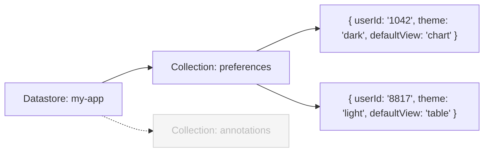

AppDB is Domo's built-in NoSQL document store. It lets apps persist and query arbitrary JSON documents without requiring an external database. Data is organized in three layers: a **Datastore** contains one or more **Collections**, and each Collection holds **Documents**.

## Data Model



| Layer          | SQL analogy | Description                                                                                                                                                           |
| -------------- | ----------- | --------------------------------------------------------------------------------------------------------------------------------------------------------------------- |
| **Datastore**  | Database    | The top-level namespace. Typically one datastore per app. Identified by a UUID `id` — not the numeric `datastore_id` that also appears in responses.                  |
| **Collection** | Table       | A typed bucket of documents. A collection's `schema` describes the fields in each document's `content` object — primarily used to sync documents into a Domo DataSet. |
| **Document**   | Row         | A JSON object with a system-managed envelope (`id`, `owner`, `createdOn`, etc.) and a free-form `content` object that holds your app data.                            |

## API Surfaces

### Product API

The Product API is the full management surface for AppDB. Authenticate with a Domo developer token:

```http
X-DOMO-Developer-Token: <your developer token>
```

Base path: `/api/datastores/`

The Product API supports the complete lifecycle — create, read, update, and delete datastores and collections; manage permissions; write and query documents; and transfer data in bulk.

### App Framework API

If you're building a Domo Custom App, a scoped proxy is available at `/domo/datastores/` that uses the card's session rather than a developer token. It covers collection and document CRUD and export, but does not expose datastore management, permission reads, download, or import — those remain Product API-only.

See the [App Framework AppDB API](/portal/API-Reference/app-framework-apis/AppDB-API) for the full reference.

## Quick Start

The following example creates a datastore, adds a collection, stores a document, and reads it back. Requires `curl` and `jq`.

**Set your credentials**

You'll need a Domo developer token — see [Manage Access Tokens](/s/article/360042934494) for instructions on generating one.

```bash
TOKEN="your-developer-token"
INSTANCE="https://yourcompany.domo.com"
```

**1. Create a datastore**

```bash
DS_ID=$(curl --silent --request POST "$INSTANCE/api/datastores/v1" \
  --header "X-DOMO-Developer-Token: $TOKEN" \
  --header "Content-Type: application/json" \
  --data '{"name":"my-app"}' | jq -r '.id')
echo "Datastore ID: $DS_ID"
```

**2. Create a collection**

```bash
COL_ID=$(curl --silent --request POST "$INSTANCE/api/datastores/v1/collections?datastoreId=$DS_ID" \
  --header "X-DOMO-Developer-Token: $TOKEN" \
  --header "Content-Type: application/json" \
  --data '{
    "name": "preferences",
    "syncEnabled": false,
    "schema": {
      "columns": [
        {"type": "STRING", "name": "theme"},
        {"type": "STRING", "name": "defaultView"}
      ]
    }
  }' | jq -r '.id')
echo "Collection ID: $COL_ID"
```

**3. Create a document**

```bash
curl --silent --request POST "$INSTANCE/api/datastores/v1/collections/$COL_ID/documents" \
  --header "X-DOMO-Developer-Token: $TOKEN" \
  --header "Content-Type: application/json" \
  --data '{"content":{"userId":"1042","theme":"dark","defaultView":"chart"}}' | jq
```

**4. Query documents**

```bash
curl --silent --request POST "$INSTANCE/api/datastores/v2/collections/$COL_ID/documents/query" \
  --header "X-DOMO-Developer-Token: $TOKEN" \
  --header "Content-Type: application/json" \
  --data '{"content.theme":{"$eq":"dark"}}' | jq
```

## Endpoint Reference

Use the sidebar to browse all endpoints, or jump to a starting point below.

### Datastores

<CardGroup cols={2}>
  <Card
    horizontal
    arrow
    title="List Datastores"
    icon="list"
    href="/api-reference/app-db-api-product/list-datastores"
  />
  <Card
    horizontal
    arrow
    title="Create Datastore"
    icon="plus"
    href="/api-reference/app-db-api-product/create-datastore"
  />
  <Card
    horizontal
    arrow
    title="Get Datastore"
    icon="magnifying-glass"
    href="/api-reference/app-db-api-product/get-datastore"
  />
  <Card
    horizontal
    arrow
    title="Delete Datastore"
    icon="trash"
    href="/api-reference/app-db-api-product/delete-datastore"
  />
  <Card
    horizontal
    arrow
    title="Sync Datastore"
    icon="arrow-up-from-bracket"
    href="/api-reference/app-db-api-product/sync-datastore"
  />
</CardGroup>

### Collections

<CardGroup cols={2}>
  <Card
    horizontal
    arrow
    title="List Collections"
    icon="list"
    href="/api-reference/app-db-api-product/list-collections"
  />
  <Card
    horizontal
    arrow
    title="Create Collection"
    icon="plus"
    href="/api-reference/app-db-api-product/create-collection"
  />
  <Card
    horizontal
    arrow
    title="Query Collections"
    icon="filter"
    href="/api-reference/app-db-api-product/query-collections"
  />
  <Card
    horizontal
    arrow
    title="Get Collection"
    icon="magnifying-glass"
    href="/api-reference/app-db-api-product/get-collection"
  />
  <Card
    horizontal
    arrow
    title="Update Collection Schema"
    icon="pen"
    href="/api-reference/app-db-api-product/update-collection"
  />
  <Card
    horizontal
    arrow
    title="Delete Collection"
    icon="trash"
    href="/api-reference/app-db-api-product/delete-collection"
  />
  <Card
    horizontal
    arrow
    title="List Permissions"
    icon="lock"
    href="/api-reference/app-db-api-product/list-collection-permissions"
  />
  <Card
    horizontal
    arrow
    title="Check User Permission"
    icon="user-check"
    href="/api-reference/app-db-api-product/check-user-permission"
  />
  <Card
    horizontal
    arrow
    title="Update Permissions"
    icon="lock-open"
    href="/api-reference/app-db-api-product/update-permissions"
  />
</CardGroup>

### Documents

<CardGroup cols={2}>
  <Card
    horizontal
    arrow
    title="List Documents"
    icon="list"
    href="/api-reference/app-db-api-product/list-documents"
  />
  <Card
    horizontal
    arrow
    title="Create Document"
    icon="plus"
    href="/api-reference/app-db-api-product/create-document"
  />
  <Card
    horizontal
    arrow
    title="Get Document"
    icon="magnifying-glass"
    href="/api-reference/app-db-api-product/get-document"
  />
  <Card
    horizontal
    arrow
    title="Update Document"
    icon="pen"
    href="/api-reference/app-db-api-product/update-document"
  />
  <Card
    horizontal
    arrow
    title="Delete Document"
    icon="trash"
    href="/api-reference/app-db-api-product/delete-document"
  />
  <Card
    horizontal
    arrow
    title="Bulk Create"
    icon="layer-plus"
    href="/api-reference/app-db-api-product/bulk-create-documents"
  />
  <Card
    horizontal
    arrow
    title="Bulk Upsert"
    icon="arrows-rotate"
    href="/api-reference/app-db-api-product/bulk-upsert-documents"
  />
  <Card
    horizontal
    arrow
    title="Bulk Delete"
    icon="trash-list"
    href="/api-reference/app-db-api-product/bulk-delete-documents"
  />
  <Card
    horizontal
    arrow
    title="Query Documents"
    icon="filter"
    href="/api-reference/app-db-api-product/query-documents"
  />
  <Card
    horizontal
    arrow
    title="Partially Update Documents"
    icon="pen-to-square"
    href="/api-reference/app-db-api-product/partially-update-documents"
  />
  <Card
    horizontal
    arrow
    title="Download Documents"
    icon="arrow-down-to-bracket"
    href="/api-reference/app-db-api-product/download-documents"
  />
  <Card
    horizontal
    arrow
    title="Import Documents"
    icon="arrow-up-to-bracket"
    href="/api-reference/app-db-api-product/import-documents"
  />
</CardGroup>
