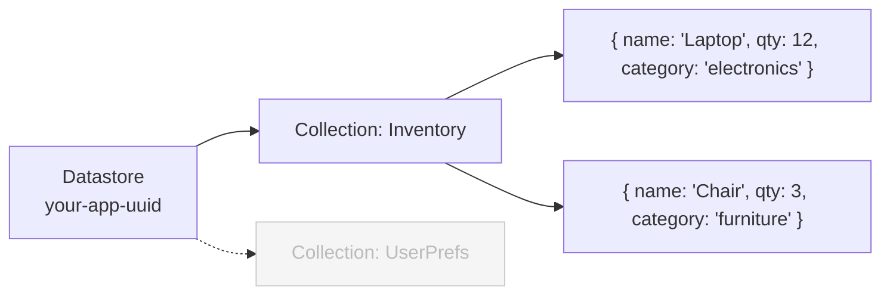

AppDB is Domo's built-in document store for Custom Apps. Your app reads and writes JSON documents directly using `domo.js` — no connector setup, no refresh schedule, no separate credentials. Data is organized in three layers:



| Layer          | Analogy  | Notes                                                     |
| -------------- | -------- | --------------------------------------------------------- |
| **Datastore**  | Database | One per app; created automatically. Identified by a UUID. |
| **Collection** | Table    | Define in the manifest or create programmatically.        |
| **Document**   | Row      | Free-form `content` object inside a system envelope.      |

## When to Use AppDB

Use AppDB when your app needs to write and manage its own data. Collections can optionally sync to Domo DataSets (via `syncEnabled: true` in the manifest), so you can use AppDB for app state and still expose that data for reporting. DataSets are the better starting point when data comes from a connector, Workbench, or ETL — rather than being written directly by your app.

|                    | AppDB                                                                     | Domo DataSet                                              |
| ------------------ | ------------------------------------------------------------------------- | --------------------------------------------------------- |
| **Best for**       | App-owned state, user-generated content, real-time reads/writes           | BI and visualization, connector-fed or ETL-processed data |
| **Data structure** | Flexible JSON — nested objects, arrays, variable shape per document       | Fixed columns and rows                                    |
| **Written by**     | Your app (via `domo.js`)                                                  | Connectors, Workbench, or the API                         |
| **Latency**        | Immediate reads/writes                                                    | Depends on connector refresh schedule                     |
| **Accessible to**  | All instances of your app; sync to a DataSet to expose data for reporting | Any card, connector, or app across the instance           |
| **Update style**   | Atomic field-level operators (`$inc`, `$set`, `$push`)                    | Full row replace                                          |

---

## Get Started

New to AppDB? The step-by-step guide walks through defining a collection, writing documents, querying with MongoDB operators, applying atomic updates, and aggregating data server-side.

<Card
  horizontal
  arrow
  title="Build an Inventory Tracker with AppDB"
  icon="rocket"
  href="/portal/Apps/App-Framework/Guides/appdb-inventory-tracker"
>
  A hands-on walkthrough covering the most important AppDB operations.
</Card>

---

## Endpoint Reference

<CardGroup cols={2}>
  <Card
    horizontal
    arrow
    title="Create Document"
    icon="plus"
    href="/api-reference/appdb-api/create-document"
  />
  <Card
    horizontal
    arrow
    title="List Documents"
    icon="list"
    href="/api-reference/appdb-api/list-documents"
  />
  <Card
    horizontal
    arrow
    title="Get Document"
    icon="magnifying-glass"
    href="/api-reference/appdb-api/get-document"
  />
  <Card
    horizontal
    arrow
    title="Update Document"
    icon="pen"
    href="/api-reference/appdb-api/update-document"
  />
  <Card
    horizontal
    arrow
    title="Delete Document"
    icon="trash"
    href="/api-reference/appdb-api/delete-document"
  />
  <Card
    horizontal
    arrow
    title="Query Documents"
    icon="filter"
    href="/api-reference/appdb-api/query-documents"
  />
  <Card
    horizontal
    arrow
    title="Partially Update Documents"
    icon="pen-to-square"
    href="/api-reference/appdb-api/partially-update-documents"
  />
  <Card
    horizontal
    arrow
    title="Create in Bulk"
    icon="layer-plus"
    href="/api-reference/appdb-api/create-documents-in-bulk"
  />
  <Card
    horizontal
    arrow
    title="Upsert in Bulk"
    icon="arrows-rotate"
    href="/api-reference/appdb-api/upsert-documents-in-bulk"
  />
  <Card
    horizontal
    arrow
    title="Delete in Bulk"
    icon="trash-list"
    href="/api-reference/appdb-api/delete-documents-in-bulk"
  />
  <Card
    horizontal
    arrow
    title="Create Collection"
    icon="folder-plus"
    href="/api-reference/appdb-api/create-collection"
  />
  <Card
    horizontal
    arrow
    title="List Collections"
    icon="folders"
    href="/api-reference/appdb-api/list-collections"
  />
  <Card
    horizontal
    arrow
    title="Update Collection"
    icon="pen"
    href="/api-reference/appdb-api/update-collection"
  />
  <Card
    horizontal
    arrow
    title="Delete Collection"
    icon="folder-minus"
    href="/api-reference/appdb-api/delete-collection"
  />
  <Card
    horizontal
    arrow
    title="Sync Collections"
    icon="arrow-up-from-bracket"
    href="/api-reference/appdb-api/sync-collections"
  />
  <Card
    horizontal
    arrow
    title="Modify Permissions"
    icon="lock-open"
    href="/api-reference/appdb-api/modify-collection-permissions"
  />
  <Card
    horizontal
    arrow
    title="Delete Permissions"
    icon="lock"
    href="/api-reference/appdb-api/delete-permissions"
  />
</CardGroup>

---

## Working with the Manifest

Defining collections in your app's manifest is the standard way to set up your app's data model. When a card is created from your app, you can either choose existing collections or have the platform create the listed collections automatically.

```json
{
  "collectionsMapping": [
    {
      "name": "Inventory"
    },
    {
      "name": "AuditLog",
      "schema": {
        "columns": [
          { "name": "user", "type": "STRING" },
          { "name": "action", "type": "STRING" },
          { "name": "timestamp", "type": "DATETIME" }
        ]
      },
      "syncEnabled": true
    }
  ]
}
```

A collection with no `schema` can store any JSON shape. A `schema` is only required if you want the collection to sync its documents to a Domo DataSet — in which case the column names must be **top-level keys** in each document's `content` object. Dot notation does not traverse nested fields during sync. Accepted column types: `STRING` · `LONG` · `DECIMAL` · `DOUBLE` · `DATE` · `DATETIME`.

### The manifest is the source of truth

<Warning>
**Do not use the Update Collection API on manifest-defined collections.** Every time the card is saved, the platform reverts the collection's properties back to what the manifest says. Changes made through the API will be silently overwritten.

To change a manifest-defined collection — add a field to its schema, enable sync — update the manifest instead.

</Warning>

After editing `manifest.json` and re-publishing your app design, **you must edit the installed card and re-save it** for the changes to take effect on existing installations.

### Creating collections programmatically

If your app needs collections that aren't known at design time — for example, per-user collections or collections created based on runtime data — use the [Create Collection](/api-reference/appdb-api/create-collection) endpoint instead of defining them in the manifest. Collections created this way are not subject to the manifest override rule and can be safely updated or deleted through the API.

---

## Collection-Level Security

AppDB collections support fine-grained access control over who can read, write, and manage a collection or its documents. Permissions can be granted to individual users, Domo groups, or the app instance itself.

See [Modify Permissions](/api-reference/appdb-api/modify-collection-permissions) for the full list of available permissions and how to apply them, and [Delete Permissions](/api-reference/appdb-api/delete-permissions) to remove an entity's access.

---

## Document-Level Security

Client-side filtering can be bypassed by users who write their own requests. To enforce filtering server-side, add document-level filter rules to a collection in your manifest:

```json
"collections": [
  {
    "name": "secureCollection",
    "filters": [
      {
        "name": "westRegionOnly",
        "applyOn": ["READ", "UPDATE", "DELETE"],
        "applyTo": [
          { "type": "GROUP_ID", "values": [12, 15] }
        ],
        "applyToAll": false,
        "limitToOwner": false,
        "query": { "content.region": "West" }
      }
    ]
  }
]
```

Users in group `12` or `15` can only see, modify, or delete documents where `content.region` equals `"West"`. Multiple rules in the `filters` array are combined with `OR`.

<Warning>
**All four core fields are required — even when empty.** Omitting any of them causes the upload to fail.

- **Required:** `name`, `applyOn`, `applyTo`, `query`
- **Optional:** `applyToAll` (default `false`), `limitToOwner` (default `false`)

Minimal example — restrict every user to only their own documents:

```json
{
  "name": "mindYaBusiness",
  "applyOn": ["READ", "UPDATE", "DELETE"],
  "applyTo": [{ "type": "USER_ID", "values": [] }],
  "query": {},
  "applyToAll": true,
  "limitToOwner": true
}
```

</Warning>

### Filter Rule Fields

**`name`** — A label for the rule. Used for identification only.

**`applyTo`** — Who the rule applies to. An array of condition objects, each with:

- `type`: `USER_ID` or `GROUP_ID`
- `values`: List of user or group IDs. Wildcards `%userId%` and `%groupIds%` are supported — e.g., `"query": {"content.user": "%userId%"}` substitutes the current user's ID at runtime.

**`applyToAll`** — When `true`, overrides `applyTo` and applies the rule to all users.

**`limitToOwner`** — When `true`, additionally restricts results to documents created by the current user.

**`applyOn`** — Which operations to filter: `READ`, `UPDATE`, `DELETE`.

**`query`** — The MongoDB query appended server-side to every matching request. The user's own query and this filter are ANDed together.

If a filter prevents a match on a single-document operation, the response is `404 Not Found`. On a bulk delete, it returns `0 documents deleted`.

<Note>
  **Note:** Filters do not apply to CREATE operations. Documents can always be
  created regardless of any filter rules defined on the collection.
</Note>

---

## App Framework vs. Product API

Two API surfaces exist for AppDB. Choose the right one for your context:

|                                | App Framework API              | Product API                                |
| ------------------------------ | ------------------------------ | ------------------------------------------ |
| **Base path**                  | `/domo/datastores/`            | `/api/datastores/`                         |
| **Auth**                       | Card session (no token needed) | Developer token (`X-DOMO-Developer-Token`) |
| **Works from**                 | Inside a running Domo app      | Any HTTP client                            |
| **Datastore management**       | Not exposed                    | Full CRUD                                  |
| **Download / Import**          | Not exposed                    | Available                                  |
| **Permission reads**           | Not exposed                    | Available                                  |
| **Collection & Document CRUD** | ✓                              | ✓                                          |
| **Sync**                       | ✓                              | ✓                                          |

This page covers the **App Framework API**. For the Product API, see [App DB API — Product](/portal/API-Reference/Product-APIs/App-DB).
