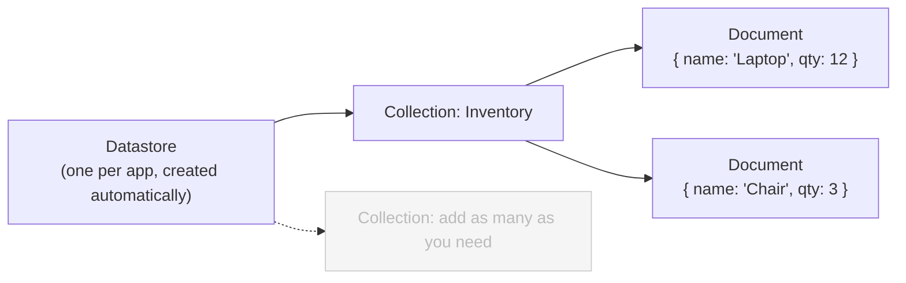
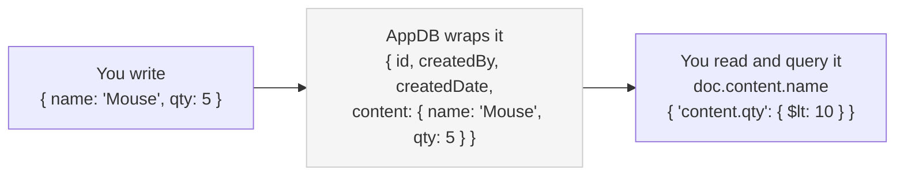

This guide builds a working inventory tracker to teach the essentials of **AppDB**, Domo's built-in document store for app data. You'll define a collection, write and query documents, update them atomically, and aggregate on the server — all without a connector or refresh cycle.

---

## Understand What AppDB Is

AppDB is a document database built into the App Framework. Your app reads and writes its own data directly — no connector, no ETL, no refresh cycle. Documents are free-form JSON, so the same collection can hold differently shaped records without defining columns first.

Reach for AppDB when your app owns its data:

- **Use AppDB** for state a user creates or edits inside the app — inventory, annotations, saved settings, form entries.
- **Use a Domo DataSet** when data arrives from a connector, Workbench, or ETL, or exists mainly to power cards and dashboards.

<Note>
  **Before you start:** You need access to a **Domo instance** where you can
  create apps, and **basic JavaScript knowledge**. Everything runs in the
  browser-based Pro-Code Editor — there's nothing to install.
</Note>

---

## Understand How AppDB Organizes Data

AppDB nests data in three layers. Your app gets one datastore, which holds collections, which hold documents.



If you've used a relational database, the analogy is direct:

| Layer          | Like a   | Notes                                                             |
| -------------- | -------- | ----------------------------------------------------------------- |
| **Datastore**  | Database | One per app; created automatically when the card is installed.    |
| **Collection** | Table    | Define in the manifest or create programmatically at runtime.     |
| **Document**   | Row      | A free-form JSON object stored inside a system-provided envelope. |

Unlike a DataSet, AppDB doesn't require a fixed column schema — documents in the same collection can have completely different shapes. That flexibility is what makes it useful for app-owned state.

### Know the `content` Envelope

Every document stores your data inside a `content` field. AppDB wraps that data in a system envelope with its own metadata (`id`, `createdBy`, timestamps), so you always write to, read from, and filter on `content`.



The takeaway before you write any code: your fields live under `content`, and queries address them as `content.fieldName`.

---

## Create the App

Go to [**Asset Library**](s/article/4403442101143) (`your-instance.domo.com/assetlibrary`) and select **Pro Code Editor** in the top-right corner. Select the **Hello World** template to create a new app.

---

## Define a Collection

Collections are the primary unit of data organization in AppDB. In the **Resources** pane (bottom-left), under **Collections**, create a new collection named `Inventory`. Saving the appearing "Inventory" tab updates your `manifest.json` to include the collection:

```json
{
  "id": "d9e480f1-0625-42e7-aedf-2f19eabb81e2",
  "name": "Hello World",
  "version": "0.0.1",
  "datasetsMapping": [],
  "size": { "width": 1, "height": 1 },
  "collectionsMapping": [
    {
      "id": "89c6a829-479a-4533-8e1b-6746df0de4ad",
      "name": "Inventory",
      "syncEnabled": false
    }
  ]
}
```

<Note>
  **Note:** The manifest controls the collection, not the API. If you later
  update this collection through the API, the platform will overwrite your
  changes the next time the card is saved. To change a manifest-defined
  collection, edit the manifest instead. See [Working with the
  Manifest](/portal/API-Reference/app-framework-apis/AppDB-API#working-with-the-manifest).
</Note>

---

## Prepare the HTML

**Replace** your app's `index.html` with the below, which

- Adds an output container for feedback
- Uses the latest version of domo.js
- Makes your `app.js` a module so it can use [async-await](https://javascript.info/async-await).

<Note>
  **Note:** This guide leads with [the `domo.appdb.*` helpers](/portal/Apps/App-Framework/Tools/domo-js#domo-appdb) from ryuu.js v6,
  which wrap your data in the `content` envelope for you and read more cleanly.
  The second **domo.js** tab in each example shows the equivalent raw REST call
  for earlier SDK versions.
</Note>

<CodeGroup>
```html domo.js v6
<html>
  <head>
    <link rel="stylesheet" href="app.css" />
  </head>
  <body>
    <div id="output"></div>
    <script src="https://unpkg.com/ryuu.js/dist/domo.js"></script>
    <script type="module" src="app.js"></script>
  </body>
</html>
```

```html domo.js
<html>
  <head>
    <link rel="stylesheet" href="app.css" />
  </head>
  <body>
    <div id="output"></div>
    <script
      src="https://unpkg.com/ryuu.js@4.6.0/dist/domo.js"
      integrity="sha384-YYsd9wQ+wDlUWhvpfGdptxmNYIqBC+52oJtWgPKJadbs3sSFTY/+ZotPbEHTTRWz"
      crossorigin="anonymous"
    ></script>
    <script type="module" src="app.js"></script>
  </body>
</html>
```

</CodeGroup>

---

## Create Documents

Because AppDB has no fixed schema, documents in the same collection can carry completely different fields — electronics carry `warranty`, furniture carries `weight`, and the notebook has neither. All live in the same `Inventory` collection with no schema change.

Replace `app.js` with the following. The v6 helper wraps each object in `content` for you; the raw call shows the envelope explicitly.

<CodeGroup>
```js domo.js v6
const output = document.getElementById("output");

// domo.appdb.bulkCreate automatically wraps each object in { content: ... }
const result = await domo.appdb.bulkCreate("Inventory", [
  {
    name: "Laptop",
    category: "electronics",
    qty: 12,
    tags: ["portable", "computing"],
    warranty: "2 years",
  },
  {
    name: "Mouse",
    category: "electronics",
    qty: 5,
    tags: ["portable", "input"],
    warranty: "1 year",
  },
  {
    name: "Desk",
    category: "furniture",
    qty: 8,
    tags: ["office"],
    weight: "25kg",
  },
  {
    name: "Chair",
    category: "furniture",
    qty: 3,
    tags: ["office", "ergonomic"],
    weight: "12kg",
  },
  {
    name: "Notebook",
    category: "stationery",
    qty: 50,
    tags: ["writing", "portable"],
  },
]);
output.textContent = `Created ${result.Created} items.`;

````

```js domo.js
const output = document.getElementById("output");

const result = await domo.post(
  "/domo/datastores/v2/collections/Inventory/documents/bulk",
  [
    {
      content: {
        name: "Laptop",
        category: "electronics",
        qty: 12,
        tags: ["portable", "computing"],
        warranty: "2 years",
      },
    },
    {
      content: {
        name: "Mouse",
        category: "electronics",
        qty: 5,
        tags: ["portable", "input"],
        warranty: "1 year",
      },
    },
    {
      content: {
        name: "Desk",
        category: "furniture",
        qty: 8,
        tags: ["office"],
        weight: "25kg",
      },
    },
    {
      content: {
        name: "Chair",
        category: "furniture",
        qty: 3,
        tags: ["office", "ergonomic"],
        weight: "12kg",
      },
    },
    {
      content: {
        name: "Notebook",
        category: "stationery",
        qty: 50,
        tags: ["writing", "portable"],
      },
    },
  ],
);
output.textContent = `Created ${result.Created} items.`;

````

</CodeGroup>

Save and verify the preview shows **Created 5 items.**

You can **preview** the contents of your collections at any time. In the Pro-Code Editor, under "Resources", click your collection. Or, once deployed, you can preview your collections in [AppDB Admin](/s/article/9221297758615).

---

## Query Documents

You can filter document using [MongoDB query operators](https://www.mongodb.com/docs/manual/reference/mql/query-predicates/) like [`$lt`](https://www.mongodb.com/docs/manual/reference/operator/query/lt/#mongodb-query-op.-lt) (less than), [`$gt`](https://www.mongodb.com/docs/manual/reference/operator/query/gt/#mongodb-query-op.-gt) (greater than), [`$regex`](https://www.mongodb.com/docs/manual/reference/operator/query/regex/), [`$jsonSchema`](https://www.mongodb.com/docs/manual/reference/operator/query/jsonSchema/) and more.

For example, if you want to find items you're running low on, you could run the below query.

Replace `app.js`:

<CodeGroup>
```js domo.js v6
const output = document.getElementById("output");

const docs = await domo.appdb.query("Inventory", {
  "content.qty": { $lt: 10 },
});
output.innerHTML =
  "<p>Low stock (under 10):</p>" +
  docs
    .map((doc) => `<p>${doc.content.name} — ${doc.content.qty} remaining</p>`)
    .join("");

````

```js domo.js
const output = document.getElementById("output");

const docs = await domo.post(
  "/domo/datastores/v2/collections/Inventory/documents/query",
  { "content.qty": { $lt: 10 } },
);
output.innerHTML =
  "<p>Low stock (under 10):</p>" +
  docs
    .map((doc) => `<p>${doc.content.name} — ${doc.content.qty} remaining</p>`)
    .join("");

````

</CodeGroup>

Save. The preview lists Desk (8), Chair (3), and Mouse (5) — the three items under the threshold. See [Query Documents](/api-reference/appdb-api/query-documents) for the full filter syntax.

---

## Update a Document Atomically

AppDB supports atomic field-level operators, so you can increment, set, or push to a field without reading the document first. The [`$inc`](https://www.mongodb.com/docs/manual/reference/operator/update/inc/) operator below adds 20 to `content.qty` on the Mouse document only — the rest of the document is unchanged.

This differs from a full-document replace in an important way: with `$inc`, concurrent updates from multiple users don't overwrite each other.

Replace `app.js`:

<CodeGroup>
```js domo.js v6
const output = document.getElementById("output");

await domo.appdb.partialUpdate(
  "Inventory",
  { "content.name": "Mouse" },
  { $inc: { "content.qty": 20 } },
);

const docs = await domo.appdb.query("Inventory", {
  "content.qty": { $lt: 10 },
});
output.innerHTML =
  "<p>Low stock after restock:</p>" +
  docs
    .map((doc) => `<p>${doc.content.name} — ${doc.content.qty} remaining</p>`)
    .join("");

````

```js domo.js
const output = document.getElementById("output");

await domo.put("/domo/datastores/v2/collections/Inventory/documents/update", {
  query: { "content.name": "Mouse" },
  operation: { $inc: { "content.qty": 20 } },
});

const docs = await domo.post(
  "/domo/datastores/v2/collections/Inventory/documents/query",
  { "content.qty": { $lt: 10 } },
);
output.innerHTML =
  "<p>Low stock after restock:</p>" +
  docs
    .map((doc) => `<p>${doc.content.name} — ${doc.content.qty} remaining</p>`)
    .join("");
````

</CodeGroup>

Save. Mouse is gone from the low-stock list — only Desk (8) and Chair (3) remain. See [Partially Update Documents](/api-reference/appdb-api/partially-update-documents) for all supported operators.

---

## Aggregate Server-Side

AppDB can group, sum, and sort your data on the server before sending the response — no DataSet refresh, no client-side sorting. This is the same `query` endpoint used above, extended with aggregation parameters.

Replace `app.js`:

<CodeGroup>
```js domo.js v6
const output = document.getElementById("output");

const groups = await domo.appdb.query(
  "Inventory",
  {},
  {
    groupby: "content.category",
    sum: "content.qty totalQty",
    orderby: "totalQty descending",
  },
);
output.innerHTML =
  "<p>Total inventory by category:</p>" +
  groups
    .map((g) => `<p>${g._id}: ${g.totalQty} units</p>`)
    .join("");

````

```js domo.js
const output = document.getElementById("output");

const groups = await domo.post(
  "/domo/datastores/v2/collections/Inventory/documents/query?groupby=content.category&sum=content.qty totalQty&orderby=totalQty descending",
  {},
);
output.innerHTML =
  "<p>Total inventory by category:</p>" +
  groups
    .map((g) => `<p>${g._id}: ${g.totalQty} units</p>`)
    .join("");
````

</CodeGroup>

Save. The preview shows totals per category, sorted highest first. See [Query Documents](/api-reference/appdb-api/query-documents) for all aggregation parameters, including `groupby`, `sum`, `avg`, and `orderby`.

---

## Inspect Your Data

To view, query, and edit your collection's documents outside your app, open [AppDB Admin](/s/article/9221297758615). The **Data Explorer** lets you run queries and modify documents interactively — useful for checking what your app wrote during development, or for debugging an unexpected query result.

---

## Where to Go Next

This walkthrough covered the core read/write operations — bulk create, query with operators, atomic update, and server-side aggregation. A few more AppDB capabilities are worth exploring:

- **Document-level security** — Enforce server-side filter rules on a collection so users see only the documents they're permitted to access, such as records matching their user ID or group. See [Document-Level Security](/portal/API-Reference/app-framework-apis/AppDB-API#document-level-security).
- **Collection permissions** — Grant specific users, groups, or the app instance itself read, write, or manage access to a collection. See [Collection-Level Security](/portal/API-Reference/app-framework-apis/AppDB-API#collection-level-security).
- **Full endpoint reference** — Every AppDB endpoint is listed on the [AppDB API Overview](/portal/API-Reference/app-framework-apis/AppDB-API).
