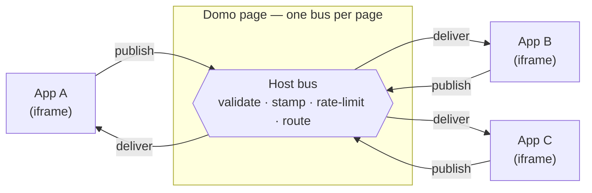
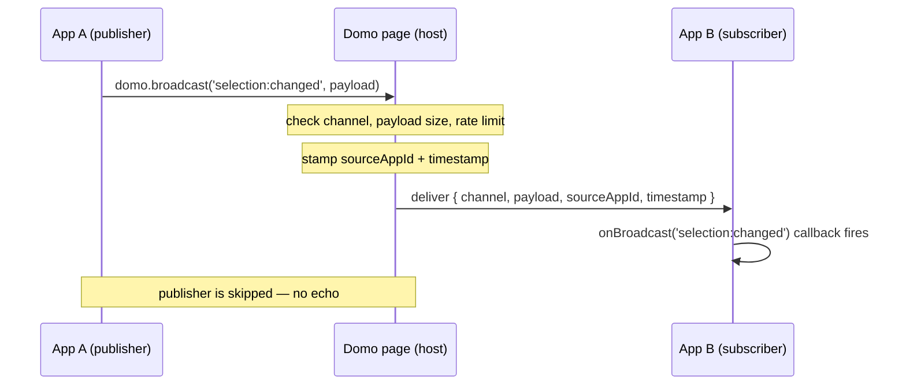

App Broadcasting lets Custom Apps on the same Domo page send each other named messages in real time. One app **publishes** a message to a **channel**; every other app that **subscribes** to that channel receives it. Apps never talk to each other directly — the Domo page (the host) sits in the middle and routes every message.

<Note>
**Note:** App Broadcasting requires the `app-broadcasting` feature switch. While it is off, publishing does nothing and no messages are delivered — the host answers each publish with a `FEATURE_DISABLED` notice that the SDK writes to the browser console. Contact your Domo administrator to enable it.
</Note>

## When to use broadcasting

Broadcasting is for **free-form, real-time coordination** between apps — the kind of signalling that page filters and variables aren't built for.

| Mechanism              | Best for                                   | Trade-offs                                       |
| ---------------------- | ------------------------------------------ | ------------------------------------------------ |
| Page filters           | Shared filter state across all cards       | Filter shapes only; clears on first registration |
| Page variables         | Shared key-value state                     | Primitive values; no event signalling            |
| `requestAppDataUpdate` | Simple one-way notifications               | No channels; no source identity                  |
| **App Broadcasting**   | Channel-based pub/sub with source identity | Single page only; nothing is retained            |

Choose broadcasting when you need:

- **Multiple independent channels** between apps (for example, selection events separate from configuration changes)
- **Source identity** — knowing which app instance sent each message
- **A declared contract** — channels named in the manifest so the app's inputs and outputs are explicit

## How it works

Every message travels **iframe → host → iframe**. The publishing app posts a message to the Domo page; the host validates and routes it; each subscribing app receives it. There is no direct iframe-to-iframe path.



Key properties:

- **Host-mediated** — Every message routes through the Domo page. Apps never see each other's iframes or `postMessage` traffic.
- **One bus per page** — A single bus is shared by all app cards on the page and is destroyed when you navigate away. There is no persistence and no cross-page messaging.
- **Broker only** — The host validates the channel, stamps the sender and a timestamp, enforces limits, and routes. It does not transform your payload.
- **Fire-and-forget** — The bus holds no history. It delivers each message to the apps subscribed **at that moment** and keeps nothing. An app that subscribes later sees only messages published after it joins.
- **No echo** — A publisher never receives its own message, even if it subscribes to the same channel.

### Message flow



## Core concepts

### Channels

A **channel** is a named string that apps publish to and subscribe on.

```javascript
domo.broadcast('selection:changed', { rowId: 42 });
domo.onBroadcast('selection:changed', (msg) => { /* ... */ });
```

Conventions:

- Use a `namespace:event` name (for example, `filter:region`, `chart:hover`, `config:theme`).
- Channel names are exact strings, compared literally.
- Names beginning with `domo:` are **reserved** for the host and are rejected.

### Messages

Each delivered message has this shape:

```typescript
interface BroadcastMessage {
  channel: string;     // Channel the message was published to
  payload: unknown;    // Data sent by the publisher
  sourceAppId: string; // ID of the app instance that published it
  timestamp: number;   // When the host delivered the message (ms since epoch)
}
```

- **`sourceAppId`** identifies the *card instance* that published the message. The host assigns it — an app cannot set or fake it — so subscribers can trust it. Two copies of the same app on one page have different `sourceAppId` values.
- **`timestamp`** is assigned by the host when it routes the message.

### Declaring channels

Apps declare the channels they use in `manifest.json`. Declarations do real work: **in production, an app receives a channel only if that channel is listed under `subscribes`.** The host subscribes each app to its declared channels when the app loads.

```json
{
  "channels": {
    "publishes": [
      { "name": "selection:changed", "description": "Fires when the user selects a row" }
    ],
    "subscribes": [
      { "name": "filter:region", "description": "Applies a region filter" }
    ]
  }
}
```

See [The Manifest File](/portal/Apps/App-Framework/Guides/manifest#channels) for the full schema.

## Limits and safety

The host enforces these on every message, in every environment:

| Rule               | Detail                                                                                                                 |
| ------------------ | ---------------------------------------------------------------------------------------------------------------------- |
| Reserved namespace | Channels starting with `domo:` are rejected (case-insensitive), on both publish and subscribe.                         |
| Source identity    | The host stamps each message with the sender's `sourceAppId`; it cannot be spoofed.                                    |
| Rate limit         | 100 messages per second, per app. The bus drops messages beyond the limit.                                             |
| Payload size       | 64 KB per message when serialized. Larger or non-serializable payloads are rejected.                                   |
| Page isolation     | The bus lives only for the current page. Navigating away clears every subscription; nothing persists or crosses pages. |

## Error handling

`domo.broadcast()` returns immediately and **never throws**. If the host rejects a publish, it notifies **only the sending app**, and the SDK writes a warning to the browser console — it does not raise an exception or reject a promise.

```
[domo.broadcast] PAYLOAD_TOO_LARGE — Payload size 91234 bytes exceeds limit of 65536 bytes (channel: data:export)
```

| Code                       | Meaning                                                         |
| -------------------------- | --------------------------------------------------------------- |
| `RESERVED_NAMESPACE`       | Channel starts with `domo:`                                     |
| `PAYLOAD_TOO_LARGE`        | Serialized payload exceeds 64 KB                                |
| `PAYLOAD_NOT_SERIALIZABLE` | Payload can't be serialized (for example, a circular reference) |
| `RATE_LIMIT_EXCEEDED`      | More than 100 messages in one second                            |
| `FEATURE_DISABLED`         | The `app-broadcasting` feature switch is off                    |

## Syncing current state on mount

Because the bus keeps no history, an app that mounts after a value was published won't have it. To catch up, have the new subscriber **ask for the current state** and let the owner republish it:

```javascript
// Newcomer: subscribe, then request the current value
domo.onBroadcast('selection:changed', (msg) => render(msg.payload));
domo.broadcast('selection:request', {});

// State owner: answer requests by republishing the latest value
let current = null;
domo.onBroadcast('selection:request', () => {
  if (current) domo.broadcast('selection:changed', current);
});
```

This keeps late-mounting apps in sync without relying on any retained state.

## Lifecycle

<Steps>
  <Step title="Page loads">
    The bus is created for the page (empty — no subscriptions yet).
  </Step>
  <Step title="Apps mount">
    The host subscribes each app to the channels it declared under `subscribes`.
  </Step>
  <Step title="Messages flow">
    Apps publish and receive messages in real time through the host.
  </Step>
  <Step title="Page navigates">
    The bus is destroyed. All subscriptions are cleared; nothing is retained.
  </Step>
</Steps>

## Quick start

**Publisher** — `manifest.json`:

```json
{
  "name": "Data Selector",
  "channels": {
    "publishes": [
      { "name": "selection:changed", "description": "User selected a row" }
    ]
  }
}
```

**Publisher** — `app.js`:

```javascript
import domo from 'ryuu.js';

function onRowClick(row) {
  domo.broadcast('selection:changed', {
    id: row.id,
    name: row.name,
    region: row.region,
  });
}
```

**Subscriber** — `manifest.json`:

```json
{
  "name": "Detail Viewer",
  "channels": {
    "subscribes": [
      { "name": "selection:changed", "description": "Show detail for the selected row" }
    ]
  }
}
```

**Subscriber** — `app.js`:

```javascript
import domo from 'ryuu.js';

domo.onBroadcast('selection:changed', (msg) => {
  document.getElementById('detail-name').textContent = msg.payload.name;
  document.getElementById('detail-region').textContent = msg.payload.region;
});
```

## Broadcasting vs. variables and filters

| Feature                | Broadcasting                         | Variables             | Filters             |
| ---------------------- | ------------------------------------ | --------------------- | ------------------- |
| Data shape             | Any serializable value (up to 64 KB) | Primitive values      | Filter objects      |
| Persistence            | Current page only                    | Saved with the page   | Saved with the page |
| Late-subscriber replay | No (fire-and-forget)                 | Yes (always current)  | Yes (current state) |
| Multiple channels      | Yes (unlimited)                      | Yes (named variables) | Single filter set   |
| Source identity        | Yes (`sourceAppId`)                  | No                    | No                  |
| Semantics              | Pub/sub events                       | Shared state          | Shared state        |
| Cross-page             | No                                   | Yes                   | Yes                 |

**Rule of thumb:** Use variables or filters for state that should survive navigation. Use broadcasting for real-time, channel-based coordination within a single page.

## Next steps

- [Broadcast SDK Reference](/portal/Apps/App-Framework/Tools/domo-js#broadcasting) — `domo.broadcast()`, `domo.onBroadcast()`, and the source-filtering helpers
- [The Manifest File](/portal/Apps/App-Framework/Guides/manifest#channels) — Channel declaration schema
- [Cross-App Broadcasting Tutorial](/portal/Apps/App-Framework/Tutorials/React/Cross-App-Broadcasting) — Build two apps that coordinate a selection and a detail view
