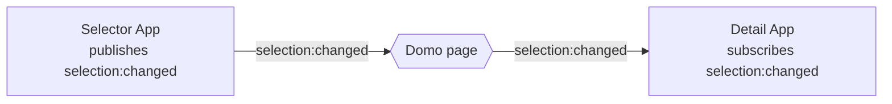

### Intro

---

This tutorial builds two Custom Apps that talk to each other in real time using [App Broadcasting](/portal/Apps/App-Framework/Guides/broadcasting). You'll create:

1. **Selector App** — a data table that publishes a `selection:changed` message whenever a user clicks a row
2. **Detail App** — a panel that subscribes to `selection:changed` and shows details for the selected record

Along the way you'll learn how to:

- Declare broadcast channels in `manifest.json`
- Publish and subscribe with `domo.broadcast()` and `domo.onBroadcast()`
- Sync current state when an app mounts late (the bus keeps no history)
- Filter messages by source with `domo.onBroadcastFrom()`



<Note>
**Prerequisites:** Complete the [Setup and Installation](/portal/Apps/App-Framework/Quickstart/Setup-and-Installation) guide. You'll place both apps on the same Domo page, and the `app-broadcasting` feature switch must be enabled on your instance.
</Note>

### Step 1: Scaffold both apps

---

Create two separate app projects:

```bash
da new selector-app
da new detail-app
```

Each produces a Vite + React + TypeScript project ready for Domo development.

### Step 2: Configure the Selector App manifest

---

Open `selector-app/manifest.json` and add the `channels` and `datasetsMapping` properties:

```json
{
  "name": "Selector App",
  "version": "1.0.0",
  "size": { "width": 3, "height": 3 },
  "datasetsMapping": [
    {
      "alias": "customers",
      "dataSetId": "YOUR_DATASET_ID",
      "fields": [
        { "alias": "id", "columnName": "Customer ID" },
        { "alias": "name", "columnName": "Customer Name" },
        { "alias": "region", "columnName": "Region" },
        { "alias": "revenue", "columnName": "Annual Revenue" }
      ]
    }
  ],
  "channels": {
    "publishes": [
      {
        "name": "selection:changed",
        "description": "Fires when the user clicks a customer row"
      }
    ]
  }
}
```

The channel name `selection:changed` uses the `namespace:event` convention: the namespace groups related channels; the event describes what happened.

### Step 3: Build the Selector App component

---

Replace `selector-app/src/App.tsx`:

```tsx
import { useEffect, useState } from 'react';
import domo from 'ryuu.js';

interface Customer {
  id: string;
  name: string;
  region: string;
  revenue: number;
}

export default function App() {
  const [customers, setCustomers] = useState<Customer[]>([]);
  const [selectedId, setSelectedId] = useState<string | null>(null);

  useEffect(() => {
    domo.get('/data/v1/customers').then(setCustomers);
  }, []);

  function handleRowClick(customer: Customer) {
    setSelectedId(customer.id);

    domo.broadcast('selection:changed', {
      id: customer.id,
      name: customer.name,
      region: customer.region,
      revenue: customer.revenue,
    });
  }

  return (
    <table>
      <thead>
        <tr>
          <th>Name</th>
          <th>Region</th>
          <th>Revenue</th>
        </tr>
      </thead>
      <tbody>
        {customers.map((c) => (
          <tr
            key={c.id}
            onClick={() => handleRowClick(c)}
            style={{
              background: c.id === selectedId ? '#e3f2fd' : 'transparent',
              cursor: 'pointer',
            }}
          >
            <td>{c.name}</td>
            <td>{c.region}</td>
            <td>${c.revenue.toLocaleString()}</td>
          </tr>
        ))}
      </tbody>
    </table>
  );
}
```

### Step 4: Configure the Detail App manifest

---

Open `detail-app/manifest.json`:

```json
{
  "name": "Detail App",
  "version": "1.0.0",
  "size": { "width": 3, "height": 3 },
  "channels": {
    "subscribes": [
      {
        "name": "selection:changed",
        "description": "Shows detailed info for the selected customer"
      }
    ]
  }
}
```

The Detail App has no datasets of its own — it gets all its data from the Selector App's messages.

<Note>
**Note:** In production, an app receives a channel only if that channel is listed under `subscribes`. Declaring `selection:changed` here is what wires the Detail App up to receive it.
</Note>

### Step 5: Build the Detail App component

---

Replace `detail-app/src/App.tsx`:

```tsx
import { useEffect, useState } from 'react';
import domo from 'ryuu.js';
import type { BroadcastMessage } from 'ryuu.js';

interface CustomerPayload {
  id: string;
  name: string;
  region: string;
  revenue: number;
}

export default function App() {
  const [customer, setCustomer] = useState<CustomerPayload | null>(null);
  const [source, setSource] = useState<string>('');

  useEffect(() => {
    const unsubscribe = domo.onBroadcast('selection:changed', (msg: BroadcastMessage) => {
      setCustomer(msg.payload as CustomerPayload);
      setSource(msg.sourceAppId);
    });

    return () => unsubscribe();
  }, []);

  if (!customer) {
    return <p style={{ color: '#666', padding: '2rem' }}>Click a row in the Selector App</p>;
  }

  return (
    <div style={{ padding: '1.5rem' }}>
      <h2>{customer.name}</h2>
      <dl>
        <dt>Region</dt>
        <dd>{customer.region}</dd>
        <dt>Annual Revenue</dt>
        <dd>${customer.revenue.toLocaleString()}</dd>
        <dt>Source App</dt>
        <dd><code>{source}</code></dd>
      </dl>
    </div>
  );
}
```

`onBroadcast` returns an unsubscribe function — call it in the effect cleanup so the subscription is removed when the component unmounts.

### Step 6: Publish and test

---

Publish both apps and place them on the same App Studio page:

```bash
cd selector-app && domo publish
cd ../detail-app && domo publish
```

In Domo, create a new App Studio page and add both apps as cards. Broadcasting happens automatically once both apps are on the same page — you don't configure any routing. Click a row in the Selector App, and the Detail App updates instantly.

### Pattern: Sync current state on mount

---

The bus keeps no history, so if the Detail App mounts *after* a row was already selected, it starts empty until the next click. To catch up, have the Detail App **request** the current selection when it mounts, and have the Selector App **answer** by republishing.

Add a request channel to both manifests — `subscribes` in the Selector, `publishes` in the Detail:

```json
// selector-app/manifest.json → channels
"publishes":  [{ "name": "selection:changed", "description": "Row selection" }],
"subscribes": [{ "name": "selection:request", "description": "Replay the current selection" }]
```

```json
// detail-app/manifest.json → channels
"subscribes": [{ "name": "selection:changed", "description": "Selected customer" }],
"publishes":  [{ "name": "selection:request", "description": "Ask for the current selection" }]
```

In the Selector App, answer requests by republishing the last selection:

```tsx
const [selection, setSelection] = useState<CustomerPayload | null>(null);

useEffect(() => {
  return domo.onBroadcast('selection:request', () => {
    if (selection) domo.broadcast('selection:changed', selection);
  });
}, [selection]);
```

In the Detail App, ask for the current selection right after subscribing:

```tsx
useEffect(() => {
  const unsubscribe = domo.onBroadcast('selection:changed', (msg) =>
    setCustomer(msg.payload as CustomerPayload),
  );
  domo.broadcast('selection:request', {}); // catch up on mount
  return () => unsubscribe();
}, []);
```

### Pattern: Filtering by source

---

If a page has multiple Selector Apps and you only want to listen to one, use `domo.onBroadcastFrom()`:

```javascript
// Only react to messages from a specific app instance
domo.onBroadcastFrom('selection:changed', 'target-app-instance-id', (msg) => {
  renderDetail(msg.payload);
});
```

The instance ID is the `sourceAppId` on any message that app sends — it identifies a specific *card instance* on the page, so two copies of the same app have different IDs. Like `onBroadcast`, this returns an unsubscribe function.

<Note>
**Note:** A visual broadcasting inspector for viewing live channel traffic and instance IDs is on the roadmap. Until then, log `sourceAppId` during development to find an instance's ID.
</Note>

### Pattern: Multi-channel coordination

---

Real apps often use several channels. Here's a Selector App that publishes both selection and hover events:

```json
{
  "channels": {
    "publishes": [
      { "name": "selection:changed", "description": "Row click" },
      { "name": "chart:hover", "description": "Mouse hover on data point" }
    ]
  }
}
```

```javascript
domo.broadcast('selection:changed', { id: row.id, name: row.name });
domo.broadcast('chart:hover', { seriesId: 'revenue', index: 3 });
```

The subscriber decides which channels it cares about:

```javascript
domo.onBroadcast('selection:changed', (msg) => updateDetail(msg.payload));
domo.onBroadcast('chart:hover', (msg) => highlightPoint(msg.payload));
```

### Pattern: One-time initialization

---

Use `domo.onBroadcastOnce()` when an app only needs a message once — for example, an initial configuration from a coordinator app. It unsubscribes automatically after the first delivery:

```javascript
domo.onBroadcastOnce('config:init', (msg) => {
  applyConfig(msg.payload);
  // Automatically unsubscribed — no further messages received
});
```

### Error handling

---

`domo.broadcast()` returns immediately and **never throws**. If the host rejects a message — a reserved `domo:` channel, a payload over 64 KB, more than 100 messages per second, or the feature switch being off — it notifies only the sending app, and the SDK writes a warning to the browser console:

```
[domo.broadcast] RATE_LIMIT_EXCEEDED — Rate limit of 100 messages/second exceeded (channel: chart:hover)
```

Because there's no thrown error to catch, watch the console during development, and design publishers to stay within the limits (for example, throttle high-frequency events like hover before broadcasting).

### Summary

---

| Concept                  | What you learned                                                                                |
| ------------------------ | ----------------------------------------------------------------------------------------------- |
| `channels` in manifest   | Declare what your app publishes and subscribes to; `subscribes` is what wires you up to receive |
| `domo.broadcast()`       | Publish a message to a channel; returns `void`, never throws                                    |
| `domo.onBroadcast()`     | Subscribe to a channel; returns an unsubscribe function                                         |
| `domo.onBroadcastFrom()` | Only receive messages from a specific app instance                                              |
| `domo.onBroadcastOnce()` | Auto-unsubscribe after the first message                                                        |
| Sync on mount            | The bus keeps no history — request current state instead of relying on replay                   |

### Next steps

- [App Broadcasting Guide](/portal/Apps/App-Framework/Guides/broadcasting) — Architecture, limits, and lifecycle
- [The Manifest File](/portal/Apps/App-Framework/Guides/manifest#channels) — Full channel declaration reference
- [domo.js SDK Reference](/portal/Apps/App-Framework/Tools/domo-js#broadcasting) — Complete API documentation
