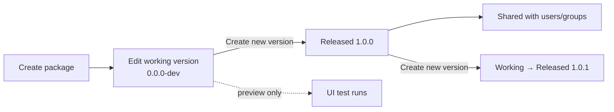

Code Engine organizes your code around three nested concepts: **packages**, **versions**, and **functions**. A package is the top-level container — think of it as a repository for a related set of functionality. A version is a point-in-time snapshot of everything inside that package: the code, the function definitions, and their input/output types. Functions are the callable units exported by a version — the individual operations that Workflows, Custom Apps, and REST clients can invoke.

This hierarchy means that when you share or call Code Engine code, you always target a specific version of a package, and within that version you call a named function. Keeping versions immutable once released lets callers depend on stable behavior while you continue developing in the working version.

Understanding the package-version-function model is foundational to everything else in Code Engine. The sections below explain how versions progress through their lifecycle, what controls their availability, and which runtime executes them.

---

## Working vs. released versions

Every package has exactly one **working version** and any number of **released versions**. The working version is always editable and is typically tagged `0.0.0-dev`. It is the scratchpad where you write and test code before cutting a release.

Released versions are read-only snapshots. Once you publish a version, its code cannot be changed — to make updates you create a new version (see [Creating a New Version](#creating-a-new-version) below). This immutability is what makes released versions safe to depend on.

**Only released versions are callable externally.** Calls from Workflows, the REST API, and Custom Apps always target a specific released version. The **Start Function** button in the Code Engine UI runs against the working version and is only accessible from within the editor — it is a development convenience, not an execution path for production code.

<Note>**Note:** If you invoke a Code Engine function from a Workflow, a Custom App, or the REST API, that call targets a released version. The working version (`0.0.0-dev`) is never reachable from outside the Code Engine editor.</Note>

---

## Semantic versioning

Version strings must match the regex `[a-zA-Z0-9\-]+` (source: `validRefNameRegex` in DomoWeb `codeEngine/models/constants.ts:71`). Any string that satisfies this pattern is accepted — letters, digits, and hyphens only, no dots by themselves are required.

In practice, Domo recommends using [semantic versioning](https://semver.org/) (`major.minor.patch`, e.g. `1.0.0`, `1.2.3`). Semver makes it easy for consumers of your package to understand the scope of a change at a glance: a major bump signals a breaking change, a minor bump signals new functionality, and a patch bump signals a backwards-compatible fix. The regex allows `1.0.0` because dots are not explicitly excluded — confirm your instance accepts dots before relying on them, or substitute hyphens (`1-0-0`) to be safe.

---

## Creating a new version

When you are ready to release changes, you create a new version by copying from a prior version. The flow is:

1. Open the package in the Code Engine editor.
2. Click **Create New Version**.
3. Select the version to copy from — usually the most recent released version or `0.0.0-dev`.
4. Enter the new version string (e.g. `1.1.0`).
5. Optionally add a version description to document what changed.
6. Click **Create New Version**. The copied code becomes your new working version, which you can edit before releasing.

The `saveVersion` API call that backs this flow is defined in DomoWeb `codeEngine/api/function.api.ts:34`. For the full UI walkthrough, see [Creating Custom Packages](../creating-packages).

---

## Availability

Every package has an **availability** setting that controls which Domo instances can see it (source: `FunctionPackage.availability` in DomoWeb `codeEngine/models/interfaces.ts:167`):

- **`GLOBAL`** — The package ships with Domo and is available in every instance. Global packages are maintained by Domo and appear in the Code Engine library for all customers.
- **`PRIVATE`** — The package is custom to the instance where it was created. Private packages are not visible to or callable from any other instance.

When you create a package, it is always `PRIVATE`. Global packages are managed by Domo's engineering team and cannot be created through the standard UI.

---

## Runtimes

Each package runs on one of two runtimes (source: `RuntimesEnumV2` in DomoWeb `codeEngine/models/enums.ts:27`):

- **JavaScript** — Executes in a Node.js environment. Suitable for most integrations and general-purpose automation.
- **Python** — Executes in a Python environment. Useful for data-science workloads and scripts that rely on Python libraries.

You choose the runtime when you create the package and cannot change it afterward. For the set of JavaScript libraries available in the runtime, see [JavaScript Libraries](../javascript-libraries). For Python, see [Python Packages](../python-packages).

---

## Runtime environments

Customer-visible packages — both `GLOBAL` and `PRIVATE` — execute on the `LAMBDA` environment. This is the only environment you will encounter when building or calling Code Engine functions (source: `Environments` enum in DomoWeb `codeEngine/models/enums.ts:32`).

<Note>**Note:** Additional environments exist internally — `ARRAKIS`, `DOMOACTION`, `MODELENDPOINT`, and `PYTILE` — but they back internal Domo package types and are not user-selectable. You do not need to configure or reference them when working with standard Code Engine packages.</Note>

---

## Lifecycle

The diagram below shows how a package moves from creation through development and into production use.

Each time you want to ship changes, you repeat the cycle: edit the working version, create a new released version, share it as needed. The working version is always the scratch space; released versions are the stable artifacts.

---

## Related

- [Functions and Types](./functions-and-types) — how a version's functions declare their inputs and outputs.
- [Permissions and Sharing](./permissions-and-sharing) — control who can view, edit, or execute a package.
- [Calling Code Engine from a Custom App](../calling/from-a-custom-app) — the most common in-Domo invocation path.
